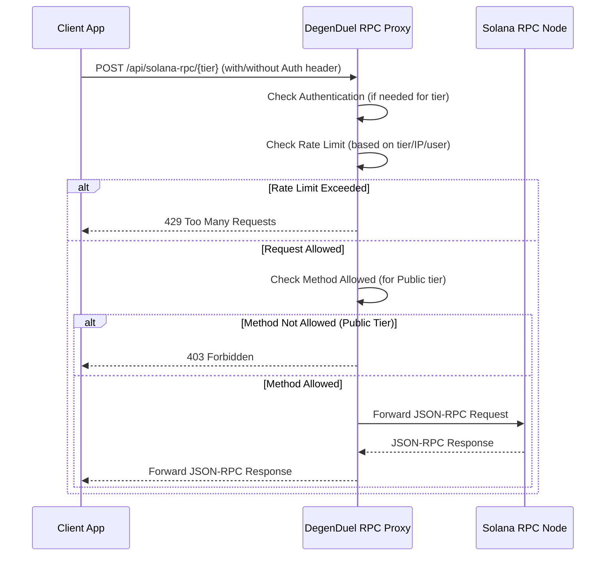
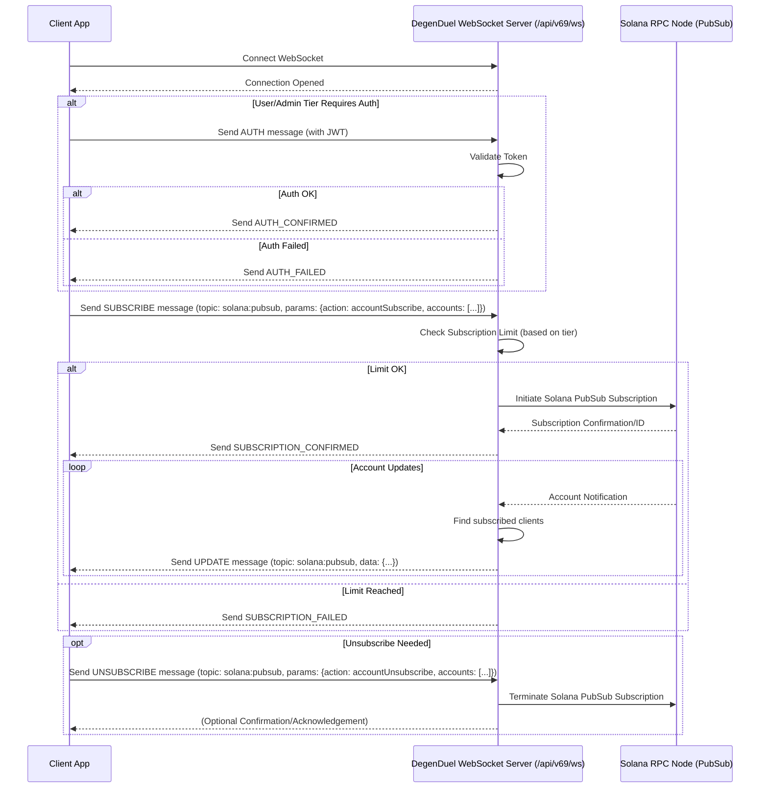

# DegenDuel RPC Proxy: Team Integration Guide
**Author:** BranchManager69
**Version:** 1.9.0
**Created:** 2025-04-28
**Updated:** 2025-04-30

---

## 1. Introduction

### 1.1 What is the DegenDuel RPC Proxy?  
The DegenDuel RPC Proxy is a secure gateway provided by the DegenDuel platform that allows client applications (frontend, bots, or other services) to interact with the Solana blockchain. It acts as an intermediary, forwarding your requests to our underlying Solana RPC nodes.

### 1.2 Why Use the Proxy?  
- **Security:** No need to manage or expose sensitive RPC node URLs or API keys in client-side code.  
- **Reliability:** Leverages DegenDuel's robust infrastructure and connection management.  
- **Rate Limiting:** Protects the underlying infrastructure and provides predictable access tiers.  
- **Simplicity:** Standardized endpoints for Solana interactions within the DegenDuel ecosystem.  
- **Observability:** Enables the DegenDuel team to monitor usage and troubleshoot issues effectively.  

### 1.3 High-Level Architecture

```mermaid
graph LR
    A[Client App (Frontend/Bot)] -- HTTPS/WSS Request --> B(DegenDuel RPC Proxy);
    B -- Processed RPC Request --> C[Solana RPC Node];
    C -- RPC Response --> B;
    B -- Proxied Response --> A;
```

---

## 2. Core Concepts: Access Tiers  

The proxy uses a tiered access system to manage usage and security. The tier determines your rate limits and allowed methods.

| Tier    | How to Access           | Authentication             | Rate Limit   | Max WS Subscriptions | Use Case                                          |
| :------ | :-----------------------| :------------------------- | :----------- | :------------------- | :------------------------------------------------ |
| Public  | `/public` endpoint      | None                       | 10 req/min   | 5 accounts           | Anonymous users, basic read-only operations       |
| User    | main endpoint           | DegenDuel JWT Token        | 120 req/min  | 10 accounts          | Logged-in DegenDuel users, standard usage         |
| Admin   | `/admin` endpoint       | DegenDuel JWT (Admin role) | 1000 req/min | 1000 accounts        | Internal tools, high-frequency operations         |

> **JWT Token:** Obtained through the standard DegenDuel authentication flow. The frontend is responsible for storing and providing this token securely.

---

## 3. HTTP RPC Proxy Integration  

Use this for standard Solana JSON-RPC calls (sending transactions, getting balances, fetching account data, etc.).

### 3.1 HTTP Request Flow Diagram



### 3.2 Endpoints  
- **Public Tier:**  
  ```http
  POST /api/solana-rpc/public
  ```  
- **User Tier:**  
  ```http
  POST /api/solana-rpc
  ```  
- **Admin Tier:**  
  ```http
  POST /api/solana-rpc/admin
  ```

### 3.3 Authentication  
- **Public:** No authentication needed.  
- **User/Admin:** Requires a valid DegenDuel JWT token passed in the `Authorization` header.

### 3.4 Request Format  
- **Method:** POST  
- **Headers:**  
  ```
  Content-Type: application/json
  Authorization: Bearer <token>   (for User/Admin tiers)
  ```  
- **Body:** A JSON-RPC 2.0 object:
  ```json
  {
    "jsonrpc": "2.0",
    "id": "<unique-request-id>",
    "method": "<solana-method-name>",
    "params": [ /* method parameters */ ]
  }
  ```

### 3.5 Response Format  
- **Success:**
  ```json
  {
    "jsonrpc": "2.0",
    "id": "<same-id-as-request>",
    "result": { /* method result */ }
  }
  ```  
- **Error:**
  ```json
  {
    "jsonrpc": "2.0",
    "id": "<same-id-as-request>",
    "error": {
      "code": <error-code>,
      "message": "<error-message>"
    }
  }
  ```

### 3.5 Public Tier Method Restrictions  
The Public tier (`/api/solana-rpc/public`) only allows a subset of safe, read-only methods. Attempting to call others returns **403 Forbidden**.  
**Allowed methods include** (but aren't limited to):  
```
getLatestBlockhash
getBalance
getAccountInfo
getTokenAccountsByOwner
getTokenAccountBalance
getSignatureStatuses
getBlockHeight
getSlot
getHealthStatus
getVersion
```  
For the definitive list, see the `/api/solana-rpc/info` endpoint or the `routes/solana-rpc-proxy.js` implementation.

### 3.6 Example (User Tier - Get Balance)  
```bash
curl -X POST https://<your-domain>/api/solana-rpc   -H "Content-Type: application/json"   -H "Authorization: Bearer <token>"   -d '{
    "jsonrpc": "2.0",
    "id": 1,
    "method": "getBalance",
    "params": ["<PublicKey>"]
  }'
```

---

## 4. WebSocket PubSub Proxy Integration  

Use this for subscribing to real-time Solana account changes.

### 4.1 WebSocket Connection & Subscription Flow Diagram



### 4.2 Endpoint  
```text
wss://<your_domain_name>/api/v69/ws
```  
Replace `<your_domain_name>` with e.g. `degenduel.me` or `dev.degenduel.me`.

### 4.3 Authentication  
After the WebSocket connection is open, send an `AUTH` message if required:  
- **Public Tier:** No `AUTH` needed.  
- **User/Admin Tiers:**  
  ```json
  { "type": "AUTH", "token": "<JWT-token>" }
  ```  
  Wait for an `AUTH_CONFIRMED` before subscribing; handle `AUTH_FAILED` appropriately.

### 4.4 Subscribing to Accounts  
- **Request:**
  ```json
  {
    "type": "SUBSCRIBE",
    "topic": "solana:pubsub",
    "address": "<PublicKey>"
  }
  ```  
- **Confirmation:** Server replies with `SUBSCRIPTION_CONFIRMED` or `SUBSCRIPTION_FAILED`.  
- **Limits:** Constrained per tier (see Section 2). Exceeding your limit → `SUBSCRIPTION_FAILED`.

### 4.5 Unsubscribing  
- **Request:**
  ```json
  {
    "type": "UNSUBSCRIBE",
    "topic": "solana:pubsub",
    "address": "<PublicKey>"
  }
  ```

### 4.6 Handling Incoming Messages  
Listen for messages where `topic: "solana:pubsub"`; payloads contain account updates.  

### 4.7 Example (User Tier - Subscribe to Account)  
```js
ws.send(JSON.stringify({
  type: "SUBSCRIBE",
  topic: "solana:pubsub",
  address: "YourPublicKeyHere"
}));
```

---

## 5. Best Practices & Implementation Notes

- **Choose the Right Tier:**  
  - Public: only for unauthenticated, read-only use.  
  - User: preferred for logged-in users.  

- **Rate Limit Handling:**  
  Implement exponential backoff on **429 Too Many Requests**, notify users if persistent.

- **Error Handling:**  
  Check both HTTP status and JSON-RPC errors; handle `AUTH_FAILED`, `SUBSCRIPTION_FAILED`, and general WebSocket errors.

- **JWT Management:**  
  Securely store & refresh tokens client-side per DegenDuel auth flow.

- **Info Endpoint:**  
  Use `GET /api/solana-rpc/info` for runtime tier & rate-limit data.

- **WebSocket Lifecycle:**  
  Implement reconnection with backoff on `onerror`/`onclose`; clean up subscriptions when no longer needed.

- **Environment Configuration:**  
  Point your app to the correct base URL (e.g., `https://degenduel.me` or `https://dev.degenduel.me`).

---

## 6. Troubleshooting Common Errors

| Error                              | Cause                                                 | Resolution                                      |
| ---------------------------------- | ----------------------------------------------------- | ----------------------------------------------- |
| **401 Unauthorized (HTTP)**        | Missing/invalid/expired JWT (User/Admin tiers)        | Re-authenticate user.                           |
| **403 Forbidden (HTTP)**           | Invalid method on Public tier or no admin privileges  | Check endpoint & permissions.                   |
| **429 Too Many Requests (HTTP)**   | Rate limit exceeded                                   | Backoff & retry or notify user.                 |
| **5xx Server Error (HTTP)**        | Proxy or Solana node issue                            | Retry later; report persistent issues.          |
| **AUTH_FAILED (WebSocket)**        | Invalid/expired JWT in `AUTH` message                 | Re-authenticate & resend `AUTH`.                |
| **SUBSCRIPTION_FAILED (WebSocket)**| Exceeded subscription limit or invalid address        | Check limits & params; report if needed.        |
| **WebSocket Disconnects**          | Network issues, server restarts, idle timeouts        | Auto-reconnect with backoff.                    |

---

## 7. Further Information

For in-depth details on the proxy implementation, see the internal documentation:  
```
SOLANA_RPC_PROXY.md
```  

---

*This guide provides everything your team needs to integrate securely and reliably with the DegenDuel RPC Proxy. Be sure to keep client-side JWT handling secure and implement robust error and rate-limit management.*
