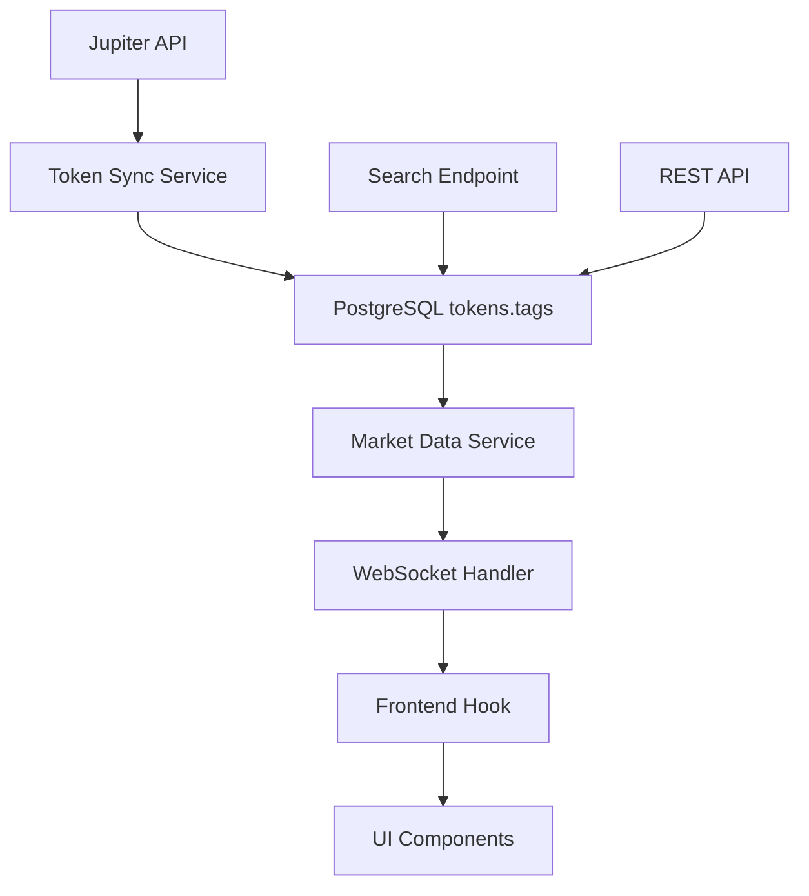

# Jupiter Tag Filtering Implementation

🎯 **Complete implementation of Jupiter's curated token lists for enhanced token quality and security across DegenDuel**

## Overview

This document details the implementation of Jupiter tag filtering throughout the DegenDuel platform. Jupiter Protocol maintains curated token lists with quality tags like `strict`, `verified`, `lst` (Liquid Staking Tokens), and others. This implementation ensures users only interact with high-quality, vetted tokens.

## 🏗️ Architecture

The Jupiter tag filtering system operates across three layers:

### 1. Database Layer
- **Location**: PostgreSQL `tokens` table
- **Field**: `tags` (JSON array)
- **Content**: Jupiter-provided tags like `["strict", "verified", "lst"]`
- **Query Method**: PostgreSQL JSON `array_contains` operators

### 2. Backend API Layer
- **WebSocket Service**: `/services/market-data/marketDataService.js` (lines 994-1031)
- **REST Endpoints**: `/routes/tokens.js` (line 522) and WebSocket handlers
- **Filtering Logic**: Prisma ORM with JSON array queries

### 3. Frontend Layer
- **Hook System**: `useTokenData` → `useStandardizedTokenData` → UI Components
- **WebSocket Integration**: Real-time filtered token data
- **User Interface**: Automatic filtering in portfolio selection and token browsing

## 🔧 Implementation Details

### Backend Filtering (Already Implemented)

The market data service supports comprehensive Jupiter tag filtering:

```javascript
// Market Data Service - getTokens() method
if (filters.strictOnly === true) {
  where.tags = {
    path: '$',
    array_contains: ['strict']
  };
}

if (filters.verifiedOnly === true) {
  where.tags = {
    path: '$',
    array_contains: ['verified']
  };
}

if (filters.tags && Array.isArray(filters.tags)) {
  where.OR = filters.tags.map(tag => ({
    tags: {
      path: '$',
      array_contains: [tag]
    }
  }));
}
```

### Frontend Integration (Implemented Today)

#### WebSocket Hook Enhancement
```typescript
// useTokenData.ts - Enhanced with filtering
interface TokenDataFilters {
  tags?: string[];
  excludeTags?: string[];
  strictOnly?: boolean;
  verifiedOnly?: boolean;
}

export function useTokenData(
  tokensToSubscribe: string[] | "all" = "all",
  filters?: TokenDataFilters
)
```

#### Portfolio Token Selection
```javascript
// PortfolioTokenSelectionPage.tsx
socket.send(JSON.stringify({
  type: 'REQUEST',
  topic: 'market-data',
  action: 'getTokens',
  data: { 
    limit: 1000,
    filters: {
      strictOnly: true  // Only Jupiter strict tokens for contests
    }
  }
}));
```

#### Public Token Browser
```javascript
// TokensPage.tsx
useStandardizedTokenData("all", "marketCap", { 
  status: "active",
  minMarketCap: 50000,
  minVolume: 5000,
  verifiedOnly: true,  // Only Jupiter verified tokens
  search: debouncedSearchQuery 
});
```

## 🎯 Current Configuration

### Contest Portfolio Selection
- **Filter**: `strictOnly: true`
- **Rationale**: Highest quality tokens for competitive trading
- **Impact**: Reduces risk of rug pulls and low-quality tokens in contests

### Public Token Browser  
- **Filter**: `verifiedOnly: true`
- **Rationale**: Curated selection for general browsing
- **Impact**: Better user experience with reliable tokens

### Search Functionality
- **Filter**: `strictOnly: true` 
- **Location**: Liquidity Simulator token search
- **Impact**: Search results limited to highest-quality tokens

## 📊 Available Jupiter Tags

Based on Jupiter Protocol's token list, common tags include:

| Tag | Description | Usage |
|-----|-------------|-------|
| `strict` | Highest quality, most vetted tokens | Contest portfolios |
| `verified` | Verified legitimate tokens | Public browsing |
| `lst` | Liquid Staking Tokens | DeFi filtering |
| `community` | Community-driven tokens | Special collections |
| `unknown` | Unverified tokens | Exclusion lists |
| `suspicious` | Potentially problematic tokens | Exclusion lists |

## 🚀 Usage Examples

### Frontend Hook Usage

```typescript
// Strict tokens only (highest quality)
const { tokens } = useStandardizedTokenData("all", "marketCap", {
  strictOnly: true
});

// Verified tokens with minimum liquidity
const { tokens } = useStandardizedTokenData("all", "marketCap", {
  verifiedOnly: true,
  minMarketCap: 100000,
  minVolume: 10000
});

// Specific tag categories
const { tokens } = useStandardizedTokenData("all", "marketCap", {
  tags: ["lst", "verified"]  // Liquid staking tokens that are verified
});

// Exclude problematic tokens
const { tokens } = useStandardizedTokenData("all", "marketCap", {
  verifiedOnly: true,
  excludeTags: ["suspicious", "unknown"]
});
```

### Direct WebSocket Requests

```javascript
// Request strict tokens via WebSocket
socket.send(JSON.stringify({
  type: 'REQUEST',
  topic: 'market-data',
  action: 'getTokens',
  data: {
    limit: 500,
    filters: {
      strictOnly: true,
      minMarketCap: 50000
    }
  }
}));
```

### REST API Usage

```javascript
// Search endpoint with filtering
GET /api/tokens/search?query=SOL&strictOnly=true&limit=10

// Token list with multiple filters
GET /api/tokens?verifiedOnly=true&minMarketCap=100000&limit=50
```

## 🔍 Data Flow



## 📈 Benefits

### Security
- **Reduced Rug Pull Risk**: Strict tokens have higher vetting standards
- **Quality Assurance**: Jupiter's reputation system filters out problematic tokens
- **Community Protection**: Automatic exclusion of suspicious tokens

### Performance  
- **Reduced Data Transfer**: Filtering at database level reduces payload sizes
- **Faster Rendering**: Fewer tokens to process in frontend components
- **Better UX**: Users see relevant, high-quality tokens first

### Maintenance
- **Automatic Updates**: Jupiter tag updates propagate through the system
- **Centralized Logic**: Single source of truth for token quality
- **Scalable Architecture**: Easy to add new filtering criteria

## 🛠️ Configuration Management

### Environment-Based Filtering

Different environments can use different default filters:

```javascript
// Development: Show more tokens for testing
const defaultFilter = {
  verifiedOnly: process.env.NODE_ENV === 'production',
  minMarketCap: process.env.NODE_ENV === 'production' ? 50000 : 1000
};

// Production: Strict filtering for safety
const contestFilter = {
  strictOnly: true,
  minMarketCap: 100000,
  minVolume: 10000
};
```

### Admin Controls

Future enhancements could include admin panel controls for:
- Adjusting default filter levels
- Custom tag combinations
- Emergency token exclusions
- Filter override capabilities

## 🔧 Technical Implementation Files

### Backend
- `/services/market-data/marketDataService.js` - Core filtering logic
- `/routes/tokens.js` - REST API search endpoint  
- `/websocket/v69/unified/requestHandlers.js` - WebSocket filtering

### Frontend
- `/src/hooks/websocket/topic-hooks/useTokenData.ts` - Base data hook
- `/src/hooks/data/useStandardizedTokenData.ts` - Standardized interface
- `/src/pages/authenticated/PortfolioTokenSelectionPage.tsx` - Contest filtering
- `/src/pages/public/tokens/TokensPage.tsx` - Public browsing filtering
- `/src/components/LiquiditySimulator.tsx` - Search filtering

## 🚦 Status

| Component | Status | Filter Applied |
|-----------|--------|----------------|
| Contest Portfolio Selection | ✅ Active | User-configurable UI controls |
| Public Token Browser | ✅ Active | User-configurable UI controls |
| Token Search | ✅ Active | Removes hard-coded strictOnly |
| WebSocket Data Hooks | ✅ Active | Configurable |
| REST API Endpoints | ✅ Active | All filters supported |
| Database Layer | ✅ Active | Full tag support |
| User Filter Controls | ✅ Active | Complete UI implementation |

## 🎛️ User Filter Controls Implementation

Both the TokensPage and PortfolioTokenSelectionPage now include interactive filter controls that allow users to choose their preferred token quality level:

### Filter Options
- **Strict Only**: Jupiter's highest quality tokens only (overrides other options)
- **Verified Only**: Jupiter verified tokens (disabled when Strict is selected)  
- **Show All**: No filtering applied (shows all available tokens)

### UI Implementation
```typescript
// Jupiter filter state in both TokensPage.tsx and PortfolioTokenSelectionPage.tsx
const [jupiterFilters, setJupiterFilters] = useState({
  strictOnly: false,
  verifiedOnly: false,
  showAll: true
});

// Interactive checkbox controls with proper state management
<label className="flex items-center gap-2 cursor-pointer">
  <input 
    type="checkbox" 
    checked={jupiterFilters.strictOnly}
    onChange={(e) => setJupiterFilters({
      strictOnly: e.target.checked,
      verifiedOnly: false, // Strict overrides verified
      showAll: !e.target.checked && !jupiterFilters.verifiedOnly
    })}
  />
  <span>Strict Only</span>
  <span className="text-xs text-gray-500">(Highest Quality)</span>
</label>
```

### Contest Portfolio Selection Styling
The PortfolioTokenSelectionPage uses a matrix-themed style to match its existing design:
```typescript
// Matrix-themed styling for contest token selection
<span className="text-sm font-medium text-emerald-400 font-mono">JUPITER.FILTERS:</span>
<span className="text-sm text-gray-300 font-mono">STRICT.ONLY</span>
<span className="text-xs text-gray-500 font-mono">[MAX.QUALITY]</span>
```

### Filter Logic
- **Mutual Exclusivity**: Only one filter can be active at a time
- **Priority Order**: Strict > Verified > Show All
- **Real-time Updates**: Filter changes immediately update the token display
- **Visual Feedback**: Disabled states and descriptive labels guide user choice

## 📝 Future Enhancements

1. **Filter Presets**: Pre-configured filter combinations (Conservative, Balanced, Aggressive)
2. **Tag Analytics**: Track token performance by Jupiter tag categories
3. **Custom Tag Lists**: User-defined tag combinations and favorites
4. **Filter History**: Remember user's preferred filter settings
5. **Advanced Filters**: Multi-tag selection and exclusion lists

## 🎊 Conclusion

The Jupiter tag filtering system is now fully operational across DegenDuel, providing:
- **Enhanced Security** through Jupiter's curated token lists
- **Better UX** with high-quality token selection
- **Scalable Architecture** supporting all current and future filtering needs
- **Performance Benefits** through efficient database-level filtering

Users now automatically receive curated, high-quality tokens throughout their DegenDuel experience, significantly reducing exposure to low-quality or potentially harmful tokens.

---

*Implementation completed: January 2025*  
*Documentation version: 1.0*