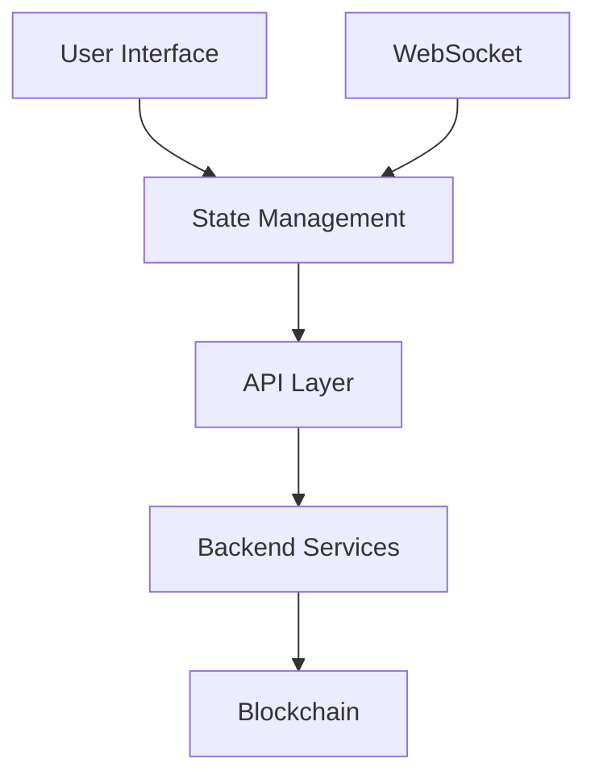

# DegenDuel Wallet Management System - Frontend Implementation Guide

## Table of Contents
1. [Overview](#overview)
2. [System Components](#system-components)
3. [Technical Requirements](#technical-requirements)
4. [Implementation Details](#implementation-details)
5. [API Integration](#api-integration)
6. [UI/UX Guidelines](#uiux-guidelines)
7. [Security Considerations](#security-considerations)
8. [Implementation Timeline](#implementation-timeline)

## Overview

The DegenDuel Wallet Management System consists of three primary components:
- Wallet Monitoring Dashboard
- Wallet Generation Interface
- Administrative Controls

This document provides comprehensive implementation guidelines for the frontend team.

## System Components

### 1. Wallet Monitoring Dashboard

#### Component Structure
```typescript
interface WalletDashboardStats {
    total_wallets: number;
    active_contests: number;
    total_balance: number;
    needs_sync: number;
    status_breakdown: {
        active: number;
        pending: number;
        completed: number;
        cancelled: number;
    }
}

interface WalletDetails {
    wallet_address: string;
    contest_id: number;
    contest_code: string;
    current_balance: number;
    balance_difference: number;
    last_sync_age: number;
    status: 'active' | 'pending' | 'completed' | 'cancelled';
}
```

#### API Endpoints
```javascript
// Main dashboard data
GET /api/admin/contest-wallets/overview
Response: {
    wallets: WalletDetails[];
    stats: WalletDashboardStats;
}

// Total SOL balance
GET /api/admin/total-sol-balance
Response: {
    success: boolean;
    data: number; // Total SOL across all wallets
}
```

#### Implementation Requirements

1. **Real-time Statistics Panel**
   - Display total wallets, active contests, total SOL balance
   - Show status breakdown in a pie chart
   - Highlight wallets needing sync (balance discrepancies)

2. **Wallet List View**
   ```typescript
   interface WalletTableColumns {
       wallet_address: string;
       contest_code: string;
       current_balance: string; // Formatted SOL amount
       status: string;
       last_sync: string; // Formatted timestamp
       actions: React.ReactNode; // Action buttons
   }
   ```
   - Sortable columns
   - Filterable by status
   - Search by wallet address or contest code
   - Pagination (10/25/50 wallets per page)

3. **Alert System**
   - Show warnings for wallets with balance discrepancies
   - Highlight wallets with long sync ages
   - Display system status notifications

### 2. Wallet Generation Interface

#### Component Structure
```typescript
interface WalletGenerationRequest {
    contest_id: number;
    preferred_pattern?: string; // Optional vanity pattern
    admin_context: {
        admin_address: string;
        ip_address: string;
        user_agent: string;
    }
}

interface GeneratedWallet {
    wallet_address: string;
    contest_id: number;
    created_at: string;
    is_vanity: boolean;
    pattern?: string;
}
```

#### API Endpoints
```javascript
// Generate new wallet
POST /api/admin/contest-wallets
Body: WalletGenerationRequest
Response: {
    success: boolean;
    data: GeneratedWallet;
}

// Check vanity pattern availability
GET /api/admin/vanity-wallets/check-pattern?pattern={pattern}
Response: {
    available: boolean;
    estimated_time?: number;
}
```

#### Implementation Requirements

1. **Generation Form**
   - Contest selection dropdown
   - Optional vanity pattern input
   - Pattern validation rules display
   - Generation progress indicator

2. **Vanity Pattern Preview**
   ```typescript
   interface PatternPreview {
       pattern: string;
       example: string;
       complexity: 'low' | 'medium' | 'high';
       estimated_time: number;
   }
   ```
   - Real-time pattern validation
   - Example address preview
   - Generation time estimate
   - Complexity indicator

3. **Generation Queue**
   - Show pending generations
   - Display queue position
   - Estimated completion time
   - Cancel option for queued requests

### 3. Administrative Controls

#### Component Structure
```typescript
interface WalletAdminControls {
    wallet_address: string;
    actions: {
        force_rake: boolean;
        manual_sync: boolean;
        view_details: boolean;
        emergency_stop: boolean;
    };
    permissions: string[];
}

interface RakeOperation {
    wallet_address: string;
    admin_address: string;
    amount: number;
    reason: string;
}
```

#### API Endpoints
```javascript
// Force rake operation
POST /api/admin/wallet-management/rake/:walletAddress
Body: {
    admin_address: string;
    reason: string;
}
Response: {
    success: boolean;
    transaction: {
        signature: string;
        amount: number;
        timestamp: string;
    }
}

// Get wallet details
GET /api/admin/wallet-management/details/:walletAddress
Response: {
    wallet_details: WalletDetails;
    transaction_history: Transaction[];
    health_metrics: HealthMetrics;
}
```

#### Implementation Requirements

1. **Action Panel**
   - Quick action buttons (rake, sync, stop)
   - Permission-based button visibility
   - Confirmation dialogs for critical actions
   - Status indicators for ongoing operations

2. **Transaction Monitor**
   ```typescript
   interface TransactionMonitor {
       recent_transactions: Transaction[];
       failed_transactions: FailedTransaction[];
       retry_options: RetryConfig[];
   }
   ```
   - Real-time transaction list
   - Failure highlighting
   - Retry mechanisms
   - Transaction details modal

3. **Emergency Controls**
   - Circuit breaker toggle
   - Emergency stop button
   - Admin override options
   - Audit log recording

## Technical Requirements

### Frontend Stack
- React 18+
- TypeScript 4.5+
- Material-UI or Tailwind CSS
- Redux/Context for state management
- Socket.IO for real-time updates

### Browser Support
- Chrome (latest 2 versions)
- Firefox (latest 2 versions)
- Safari (latest 2 versions)
- Edge (latest version)

### Performance Requirements
- Initial load < 3 seconds
- Real-time updates < 100ms
- Smooth scrolling and interactions
- Responsive design (desktop-first)

## Implementation Details

### Data Flow Architecture


### State Management
```typescript
interface WalletManagementState {
    dashboard: {
        stats: WalletDashboardStats;
        wallets: WalletDetails[];
        filters: FilterState;
        pagination: PaginationState;
    };
    generation: {
        queue: GenerationQueue;
        patterns: PatternState;
        progress: ProgressState;
    };
    admin: {
        permissions: string[];
        activeOperations: Operation[];
        alerts: Alert[];
    };
}
```

### Error Handling
```typescript
interface ErrorResponse {
    error: string;
    code: string;
    details?: any;
    retry_available?: boolean;
}

interface ErrorHandler {
    handleApiError: (error: ErrorResponse) => void;
    handleNetworkError: (error: Error) => void;
    handleValidationError: (error: ValidationError) => void;
}
```

## API Integration

### Example Data Structures

#### Wallet Overview Response
```javascript
{
    "success": true,
    "data": {
        "wallets": [{
            "wallet_address": "BPuRhkeCkor7DxMrcPVsB4AdW6Pmp5oACjVzpPb72Mhp",
            "contest_id": 123,
            "contest_code": "WEEKLY-001",
            "current_balance": 1.5,
            "balance_difference": 0.001,
            "last_sync_age": 300,
            "status": "active"
        }],
        "stats": {
            "total_wallets": 100,
            "active_contests": 25,
            "total_balance": 150.5,
            "needs_sync": 3,
            "status_breakdown": {
                "active": 25,
                "pending": 10,
                "completed": 60,
                "cancelled": 5
            }
        }
    }
}
```

#### Transaction History Response
```javascript
{
    "success": true,
    "data": {
        "transactions": [{
            "signature": "5UYkq9RjpvkbY8uv2Dj9SGwwUPwM5R1E5YK9WFt8BvJNYxhwPeGe2kQyxqNHD1K6",
            "type": "RAKE",
            "amount": 0.5,
            "timestamp": "2024-02-20T15:30:00Z",
            "status": "confirmed",
            "admin": "Admin1",
            "reason": "Manual rake operation"
        }]
    }
}
```

## UI/UX Guidelines

### Theme & Layout
- Use DegenDuel's existing color scheme
- Responsive design (desktop-first)
- Consistent spacing and typography
- Clear visual hierarchy

### Component Guidelines
1. **Buttons & Controls**
   - Clear action labeling
   - Consistent positioning
   - Appropriate color coding
   - Loading states

2. **Forms & Inputs**
   - Inline validation
   - Clear error messages
   - Autocomplete where appropriate
   - Progressive disclosure

3. **Data Display**
   - Clear data hierarchy
   - Sortable tables
   - Filterable lists
   - Pagination controls

### Responsive Breakpoints
```css
/* Breakpoint definitions */
$breakpoints: (
    'mobile': 320px,
    'tablet': 768px,
    'desktop': 1024px,
    'wide': 1440px
);
```

## Security Considerations

### Authentication & Authorization
- Role-based access control (RBAC)
- JWT token management
- Session timeout handling
- API request signing

### Data Protection
- Sensitive data encryption
- Secure storage practices
- XSS prevention
- CSRF protection

### Audit Logging
```typescript
interface AuditLog {
    action: string;
    admin: string;
    timestamp: string;
    details: any;
    ip_address: string;
    user_agent: string;
}
```

## Implementation Timeline

### Phase 1 - Core Features (0-3 minutes)
- [ ] Dashboard layout & wallet list
- [ ] Generation interface with vanity support
- [ ] Admin controls & emergency features
- [ ] Real-time updates via WebSocket

### Phase 2 - Polish & Security (4-7 minutes)
- [ ] Error handling & recovery
- [ ] Security features & RBAC
- [ ] Performance optimization
- [ ] UI/UX refinements

### Phase 3 - Testing & Deploy (8-10 minutes)
- [ ] Critical path testing
- [ ] Security validation
- [ ] Production deployment
- [ ] Monitoring setup

### Deployment Checklist
1. Pre-deploy (Minute 8)
   - Final code review
   - Security scan
   - Environment check

2. Deploy (Minute 9)
   - Frontend deployment
   - Backend sync verification
   - Cache warm-up

3. Post-deploy (Minute 10)
   - Health check
   - Monitoring verification
   - Alert system test

**Note:** All features must be production-ready and fully tested within the 10-minute window. No exceptions.

## Testing Requirements

### Unit Testing
- Component testing with Jest
- State management testing
- API integration testing
- Error handling testing

### Integration Testing
- End-to-end testing with Cypress
- User flow testing
- Error scenario testing
- Performance testing

### Security Testing
- Penetration testing
- Authentication testing
- Authorization testing
- Data protection testing

## Deployment Considerations

### Build Process
```bash
# Production build
npm run build

# Development build
npm run build:dev

# Testing build
npm run build:test
```

### Environment Configuration
```typescript
interface Environment {
    API_URL: string;
    WS_URL: string;
    ENV: 'development' | 'staging' | 'production';
    DEBUG: boolean;
    FEATURES: string[];
}
```

### Performance Monitoring
- Implement error tracking (e.g., Sentry)
- Performance monitoring (e.g., New Relic)
- User analytics (e.g., Mixpanel)
- Real-time monitoring dashboard

---

*Last Updated: February 2024*
*Contact: DegenDuel Platform Team* 