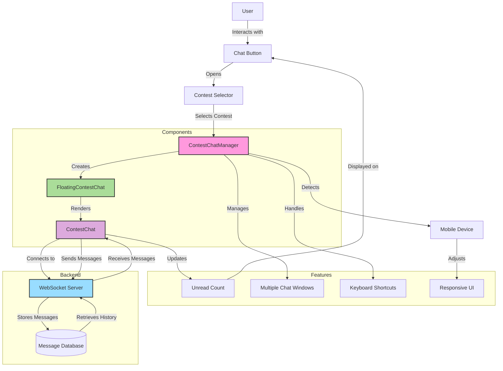

This diagram illustrates the architecture and data flow of the Contest Chat System. It shows how the user interacts with the chat button, which opens the contest selector. The ContestChatManager creates FloatingContestChat components, which render the ContestChat interface. The ContestChat connects to the WebSocket server to send and receive messages in real-time.

The diagram also shows how unread counts are tracked and displayed on the chat button, and how the system handles multiple chat windows, keyboard shortcuts, and responsive UI for mobile devices.

The backend section shows the WebSocket server and the message database, illustrating how messages are stored and retrieved.

To view this diagram, you'll need a Markdown viewer that supports Mermaid diagrams, or you can use the Mermaid Live Editor at https://mermaid.live/.
