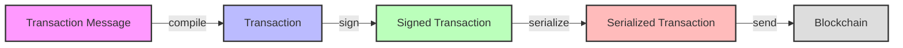
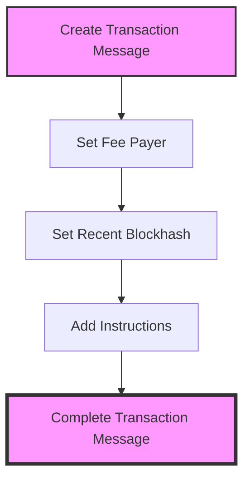
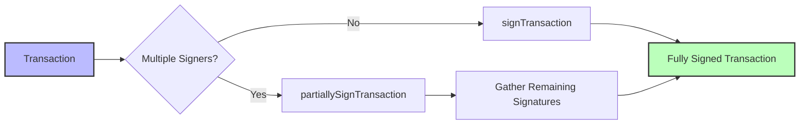
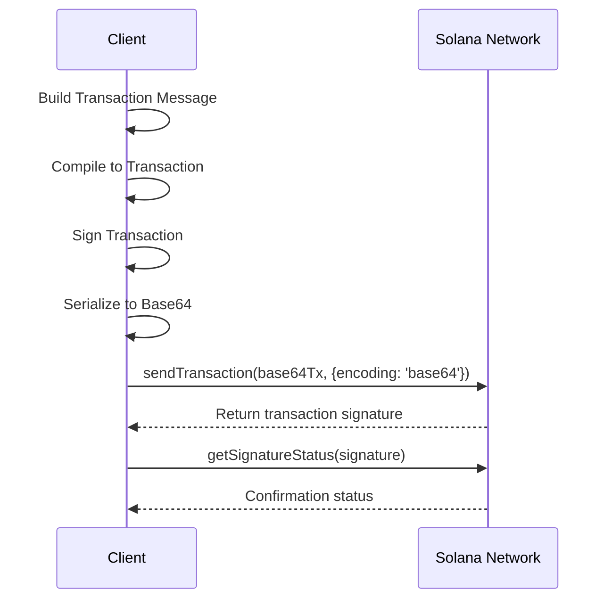
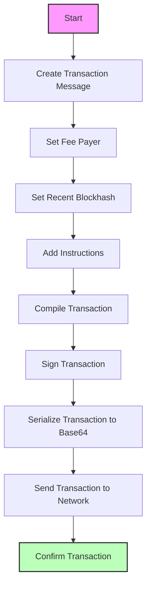

# Implementing Solana Transactions with the v2.1 Model

## Overview

With Solana's v2.1 JavaScript SDK (the "Solana Kit"), transactions are constructed and signed in a more structured way using separate transaction messages and transactions. This guide covers how to:

- Build a transaction message
- Compile it into a transaction
- Sign and serialize it
- Send it to the network

We also clarify the role of Base58 (bs58) vs Base64 encoding and best practices for successful transaction submission.

## Transaction Message vs. Transaction



### Transaction Message
A transaction message is an object that contains:
- Instructions
- Account addresses
- Recent blockhash (lifetime)

It defines what the transaction will do and who is involved, but it is **not yet signed**. In Solana v2.1, you build a `TransactionMessage` step by step using `@solana/transaction-messages` utility functions.

### Transaction
A transaction is the compiled, signable form of that message. When you compile a `TransactionMessage`, you get a `Transaction` object that includes:
- The message in wire format (bytes)
- Placeholders for signatures

The `Transaction` knows which addresses must sign (it maintains a map of required signer addresses) but initially has no signatures attached. Once all required signatures are added, it becomes a fully signed transaction ready to send.

In short:
1. Build a `TransactionMessage` (with instructions, fee payer, blockhash)
2. Compile it into a `Transaction`
3. Sign the `Transaction` with the required key(s)
4. The signed `Transaction` can then be serialized and sent over the network

## Building a Transaction Message (using @solana/transaction-messages)

Start by creating a transaction message and adding the necessary components. The `@solana/transaction-messages` package provides helper functions in an immutable, functional style (each function returns a new modified message, leaving the original unchanged). You can chain these modifications or use a pipelining helper like `pipe` from `@solana/functional` for cleaner code:

### 1. Create an empty TransactionMessage

Use `createTransactionMessage({ version: 0 })` to start a new message. The `version: 0` denotes a versioned transaction (v0) – you can also use 'legacy' for legacy transactions. Version 0 supports address lookup tables if needed, but if none are used it behaves like a normal transaction. For new applications, using version 0 is recommended.

### 2. Set the Fee Payer

Every transaction needs a fee-paying account. Use `setTransactionMessageFeePayer(feePayerAddress, message)` to specify which address will pay the fee. The `feePayerAddress` should be a base58 string of a valid public key (e.g., use your Keypair's `publicKey.toBase58()` or the `address()` helper from `@solana/addresses`).

### 3. Set the Recent Blockhash (Lifetime)

Solana transactions require a recent blockhash to define their lifetime. Use `setTransactionMessageLifetimeUsingBlockhash(latestBlockhash, message)` to set the recent blockhash. You can obtain a recent blockhash via an RPC call (e.g., `rpc.getLatestBlockhash()` or `connection.getLatestBlockhash()`).

### 4. Add Instructions

Finally, attach the instructions that perform the desired actions. Use `appendTransactionMessageInstruction(instruction, message)` to add a single `TransactionInstruction` to the message. If you have multiple instructions, you can call this function repeatedly or use `appendTransactionMessageInstructions` for an array of instructions.



### Complete Example

```javascript
import { pipe } from '@solana/functional';
import {
  createTransactionMessage,
  setTransactionMessageFeePayer,
  setTransactionMessageLifetimeUsingBlockhash,
  appendTransactionMessageInstruction
} from '@solana/transaction-messages';

// Assume feePayerPubkey, latestBlockhash, and transferInstruction are already defined.
const txMessage = pipe(
  createTransactionMessage({ version: 0 }),
  (msg) => setTransactionMessageFeePayer(feePayerPubkey, msg),
  (msg) => setTransactionMessageLifetimeUsingBlockhash(latestBlockhash, msg),
  (msg) => appendTransactionMessageInstruction(transferInstruction, msg)
);
```

After these steps, `txMessage` is a `TransactionMessage` that includes your fee payer, a valid blockhash, and the desired instruction(s). Notably, the `TransactionMessage` type will enforce at compile-time that you've set a fee payer and lifetime. If you forget one of these, TypeScript will throw a type error (e.g. "Property 'feePayer' is missing…").

## Compiling the Message into a Transaction

Once you have a complete transaction message, compile it into a `Transaction` object using the `compileTransaction(message)` function from the `@solana/transactions` package:

```javascript
import { compileTransaction } from '@solana/transactions';

const transaction = compileTransaction(txMessage);
// Now `transaction` has the binary message and knows which pubkeys need to sign.
```

At this stage, the transaction is not yet signed. The compile step will populate that the fee payer's signature is required (and any other program-specified signer accounts from the instructions).

> **Why separate message and transaction?** This design cleanly separates construction of the transaction contents from signing. It also aligns with Solana's runtime, where a Message + signatures = Transaction. By building a message first, you can inspect or modify it easily, and the SDK can ensure you don't forget crucial fields before signing.

## Signing the Transaction

After compiling, you must sign the `Transaction` with all required signers' private keys. The `@solana/transactions` package provides:

- `signTransaction([signerKeys], transaction)` – Signs the transaction with all provided private keys and returns a new `FullySignedTransaction`. All required signers must be provided.

- `partiallySignTransaction([signerKeys], transaction)` – Similar to `signTransaction` but does not require every signer. It will attach whatever signatures are provided and leave the rest empty.

```javascript
import { signTransaction } from '@solana/transactions';

// Assume `feePayerKeypair` is a Keypair for the fee payer
const signedTx = await signTransaction([feePayerKeypair], transaction);
```

If using `Keypair` from `@solana/web3.js`, you can pass it directly in the array. The new API will accept the `.secretKey` from it internally.

> **Important:** Always compile the message before signing. If you try to sign a `TransactionMessage` directly, it won't work – you need the `Transaction` object.



## Serializing and Sending the Transaction

Once fully signed, the Transaction needs to be serialized for submission to the blockchain:

```javascript
import { getBase64EncodedWireTransaction } from '@solana/transactions';

const serializedTx = getBase64EncodedWireTransaction(signedTx);
```

Now `serializedTx` is a Base64 string (type `Base64EncodedWireTransaction`) that you can send via RPC:

```javascript
const signature = await rpc.sendTransaction(serializedTx, { encoding: 'base64' }).send();
```

In this call, we pass `{ encoding: 'base64' }` to let the node know the transaction is Base64-encoded. The RPC will return the transaction signature (as a base58 string) if the submission was accepted.

### Base58 vs. Base64 Encoding

- **Base64** is recommended for performance and is supported by Solana RPC since 2021.
- **Base58** is human-readable but less efficient for large payloads.

Using `getBase64EncodedWireTransaction` and specifying `encoding: 'base64'` when sending is the recommended approach.



## Real-World Implementation Example

Here's an example of implementing a token transfer using the Solana v2.1 API:

```javascript
// STEP 1: Build the transaction message
// Create an empty transaction message with version 0
let txMessage = createTransactionMessage({ version: 0 });

// Set the fee payer using base58 string
txMessage = setTransactionMessageFeePayer(fromKeypair.publicKey.toBase58(), txMessage);

// Set transaction lifetime using blockhash
txMessage = setTransactionMessageLifetimeUsingBlockhash(latestBlockhash.blockhash, txMessage);

// Add the transfer instruction to the message
txMessage = appendTransactionMessageInstruction(transferInstruction, txMessage);

// STEP 2: Compile the message into an unsigned transaction
const transaction = compileTransaction(txMessage);

// STEP 3: Sign the transaction with the sender's keypair
const signedTransaction = await signTransaction([fromKeypair.secretKey], transaction);

// STEP 4: Encode the signed transaction for sending
const encodedTransaction = getBase64EncodedWireTransaction(signedTransaction);

// STEP 5: Send the transaction with proper encoding specified
const txSignature = await rpc.sendTransaction(encodedTransaction, {
  encoding: 'base64',
  skipPreflight: false,
  preflightCommitment: connection.commitment || 'confirmed'
}).send();
```

## Best Practices for Successful Transaction Submission

### 1. Use a Fresh Blockhash
Always fetch a recent blockhash before creating your transaction message. This gives your transaction a validity window (usually ~2 minutes). Don't reuse old blockhashes, as the transaction will be rejected if the blockhash is expired.

### 2. Ensure All Required Signatures
Make sure every account marked as a signer in your instructions has a signature attached before sending. If you forget to sign with one of the required keys, the network will reject the transaction with "Signature verification failed: missing signature for...".

### 3. Fee Payer Has Sufficient Funds
The fee payer account must have enough SOL to cover the transaction fee (and any rent-exemption or lamport transfers in the instructions).

### 4. Use Proper Encoding when Sending
Specify the encoding as `base64` for the transaction when calling RPC methods. This prevents encoding-related errors.

### 5. Confirm the Transaction
Just sending a transaction does not guarantee it lands on a block – it could be dropped or fail. Confirm it was executed using methods like:
- `sendAndConfirmTransactionFactory` (with RPC websocket subscription)
- `getSignatureStatuses` to poll the status
- `connection.confirmTransaction` if using the older web3.js `Connection`

### 6. Optional: Retrieve the Signature Locally
You can get the transaction's signature client-side before sending by using `getSignatureFromTransaction(signedTx)`. This gives the 64-byte signature as a base58 string (the transaction ID).

## Complete Transaction Flow



---

By following these steps using the dedicated v2.1 transaction message builder, you'll align with Solana's best practices and the latest SDK patterns. This ensures your transactions are constructed correctly and have the best chance of being accepted by the network. 