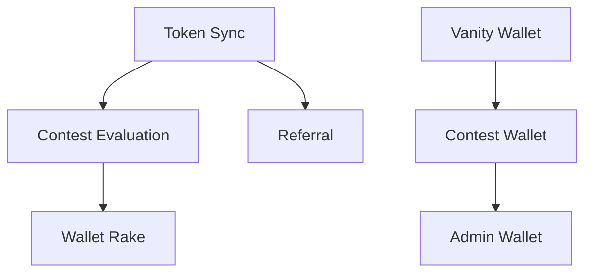

# DegenDuel Service Purposes

This document describes the practical purposes and operations of each service in the DegenDuel platform. While `SERVICE_ARCHITECTURE.md` focuses on how our services are built, this document focuses on what they do and why they exist.

## Core Services Overview

### 1. Token Sync Service
**Primary Purpose**: Maintains up-to-date token data for the entire platform.

**Key Operations**:
- Fetches and updates current token prices
- Maintains token metadata (descriptions, social links)
- Handles token list changes
- Manages market data cache

**Active Periods**:
- Price updates every 30 seconds
- Metadata checks each cycle
- On-demand for token list updates

**Critical Functions**:
- Ensures accurate pricing for contests
- Maintains token information consistency
- Provides market data for UI/UX

**Circuit Breaker Triggers**:
- External API failures (3 consecutive)
- Database update failures
- Rate limit violations from market data providers
- Data inconsistency detection
- Cache corruption

**Service Statistics**:
```javascript
{
    operations: {
        price_updates: 0,
        metadata_updates: 0,
        cache_hits: 0,
        cache_misses: 0
    },
    performance: {
        avg_price_update_ms: 0,
        avg_metadata_update_ms: 0
    },
    errors: {
        api_failures: 0,
        rate_limits: 0,
        data_inconsistencies: 0
    }
}
```

**Common Issues & Recovery**:
- Market API timeouts: Falls back to cached data
- Rate limiting: Implements exponential backoff
- Data inconsistency: Forces full resync
- Cache corruption: Triggers automatic rebuild

### 2. Contest Evaluation Service
**Primary Purpose**: Manages the entire contest lifecycle and winner determination.

**Key Operations**:
- Starts scheduled contests
- Ends contests and calculates rankings
- Distributes prizes to winners
- Processes contest refunds
- Handles tie-break scenarios

**Active Periods**:
- Checks every minute for contest state changes
- During prize distribution
- For auto-cancellations (after 3 days)

**Critical Functions**:
- Ensures fair contest completion
- Manages prize distribution
- Handles contest state transitions

**Circuit Breaker Triggers**:
- Prize distribution failures
- Blockchain transaction timeouts
- Database consistency errors
- Multiple tie-break failures
- Wallet operation errors

**Service Statistics**:
```javascript
{
    contests: {
        active: 0,
        completed: 0,
        cancelled: 0
    },
    distributions: {
        successful: 0,
        failed: 0,
        pending: 0
    },
    tiebreaks: {
        processed: 0,
        resolved: 0,
        failed: 0
    }
}
```

**Common Issues & Recovery**:
- Failed prize distribution: Automatic retry with logging
- Tie-break errors: Falls back to timestamp-based resolution
- Transaction timeout: Implements verification and retry
- State inconsistency: Triggers contest audit

### 3. Wallet Rake Service
**Primary Purpose**: Manages platform fee collection and wallet cleanup.

**Key Operations**:
- Collects platform fees (10% of prize pools)
- Recovers unused funds from contest wallets
- Maintains wallet balance thresholds
- Transfers funds to master wallet

**Active Periods**:
- Every 10 minutes for wallet checks
- After contest completion/cancellation
- On manual admin triggers

**Critical Functions**:
- Ensures platform revenue collection
- Maintains wallet hygiene
- Prevents fund abandonment

**Circuit Breaker Triggers**:
- Multiple transfer failures
- Insufficient balance errors
- Blockchain network issues
- Key verification failures

**Service Statistics**:
```javascript
{
    rake_operations: {
        total_attempted: 0,
        successful: 0,
        failed: 0
    },
    amounts: {
        total_raked: 0,
        fees_collected: 0,
        pending_collection: 0
    },
    wallets: {
        processed: 0,
        pending: 0,
        failed: 0
    }
}
```

**Common Issues & Recovery**:
- Transfer failure: Queues for next cycle
- Network issues: Implements exponential backoff
- Balance errors: Triggers admin alert
- Key issues: Forces wallet audit

### 4. Admin Wallet Service
**Primary Purpose**: Provides secure administrative wallet operations.

**Key Operations**:
- Handles secure key management
- Processes manual fund transfers
- Monitors wallet balances
- Manages mass transfer operations
- Provides secure wallet exports

**Active Periods**:
- On-demand for admin operations
- During periodic health checks
- For emergency fund movements

**Critical Functions**:
- Enables secure admin operations
- Provides emergency fund control
- Maintains operational security

**Circuit Breaker Triggers**:
- Encryption/decryption failures
- Multiple authentication failures
- Suspicious operation patterns
- Key verification errors

**Service Statistics**:
```javascript
{
    operations: {
        transfers: 0,
        key_operations: 0,
        mass_operations: 0
    },
    security: {
        auth_failures: 0,
        suspicious_patterns: 0
    },
    performance: {
        avg_operation_time: 0,
        peak_operation_time: 0
    }
}
```

**Common Issues & Recovery**:
- Auth failures: Implements lockout
- Operation errors: Requires manual review
- Key issues: Forces re-encryption
- Suspicious activity: Triggers security audit

### 5. Referral Service
**Primary Purpose**: Manages user referral system and rewards.

**Key Operations**:
- Tracks referral clicks/conversions
- Manages referral periods
- Maintains referral rankings
- Processes milestone achievements
- Distributes referral rewards

**Active Periods**:
- Every 5 minutes for reward processing
- During user interactions
- For leaderboard updates
- When caching statistics

**Critical Functions**:
- Drives user acquisition
- Manages reward distribution
- Maintains referral integrity

**Circuit Breaker Triggers**:
- Click spam detection
- Conversion tracking errors
- Reward distribution failures
- Database consistency issues

**Service Statistics**:
```javascript
{
    tracking: {
        clicks: 0,
        conversions: 0,
        spam_detected: 0
    },
    rewards: {
        distributed: 0,
        pending: 0,
        failed: 0
    },
    milestones: {
        achieved: 0,
        processing: 0
    }
}
```

**Common Issues & Recovery**:
- Click spam: Implements rate limiting
- Tracking errors: Forces reconciliation
- Distribution fails: Queues for retry
- Data issues: Triggers validation

### 6. Contest Wallet Service
**Primary Purpose**: Manages contest-specific wallet lifecycle.

**Key Operations**:
- Creates secure contest wallets
- Assigns vanity wallets to contests
- Manages wallet key encryption
- Tracks wallet status
- Monitors wallet health

**Active Periods**:
- During contest creation
- For wallet assignments
- During periodic health checks

**Critical Functions**:
- Ensures contest wallet security
- Manages wallet assignments
- Maintains wallet state

**Circuit Breaker Triggers**:
- Wallet creation failures
- Key encryption errors
- Assignment conflicts
- Balance verification issues

**Service Statistics**:
```javascript
{
    wallets: {
        created: 0,
        assigned: 0,
        active: 0
    },
    security: {
        encryption_ops: 0,
        verification_ops: 0
    },
    errors: {
        creation_fails: 0,
        assignment_fails: 0
    }
}
```

**Common Issues & Recovery**:
- Creation fails: Retries with new keypair
- Encryption errors: Forces key regeneration
- Assignment issues: Triggers reconciliation
- Verification fails: Initiates wallet audit

### 7. Vanity Wallet Service
**Primary Purpose**: Maintains pre-generated vanity wallet pool.

**Key Operations**:
- Manages vanity wallet pool
- Tracks wallet availability
- Handles contest assignments
- Monitors pool health
- Maintains pattern distribution

**Active Periods**:
- Hourly pool health checks
- During wallet assignments
- For pool replenishment
- When adding new wallets

**Critical Functions**:
- Ensures vanity wallet availability
- Maintains pool health
- Tracks wallet distribution

**Circuit Breaker Triggers**:
- Pool depletion events
- Generation failures
- Assignment conflicts
- Pattern validation errors

**Service Statistics**:
```javascript
{
    pool: {
        total_wallets: 0,
        available: 0,
        assigned: 0
    },
    patterns: {
        distribution: {},
        generation_requests: 0
    },
    health: {
        below_threshold_count: 0,
        replenishment_attempts: 0
    }
}
```

**Common Issues & Recovery**:
- Pool depletion: Triggers generation
- Assignment conflicts: Forces reconciliation
- Pattern issues: Validates pool integrity
- Generation fails: Implements backoff

## Service Dependencies



## Critical Paths

1. **Contest Operations**:
   - Contest Wallet Service creates wallet
   - Contest Evaluation Service manages lifecycle
   - Wallet Rake Service handles cleanup

2. **User Acquisition**:
   - Referral Service tracks interactions
   - Token Sync Service provides market data
   - Contest Evaluation Service validates rewards

3. **Administrative Control**:
   - Admin Wallet Service provides control
   - Contest Wallet Service manages assignments
   - Vanity Wallet Service supplies special wallets

## Health Monitoring

Each service maintains its own health metrics and circuit breakers:
- Operation success/failure rates
- Performance metrics
- Resource utilization
- Error patterns
- State transitions

## Service Communication

While services maintain independence, they communicate through:
- Database state changes
- System settings
- Admin logging
- Health metrics
- Event triggers 