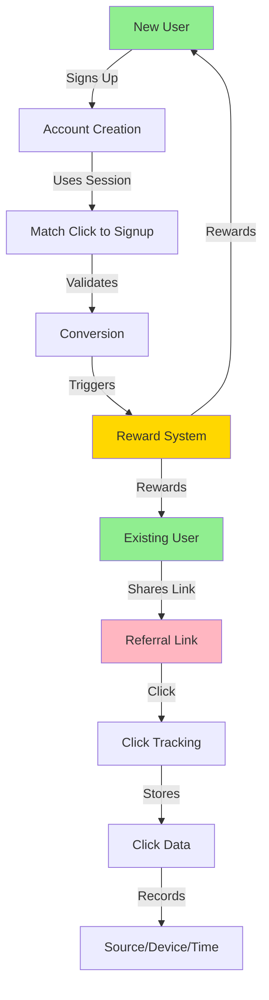
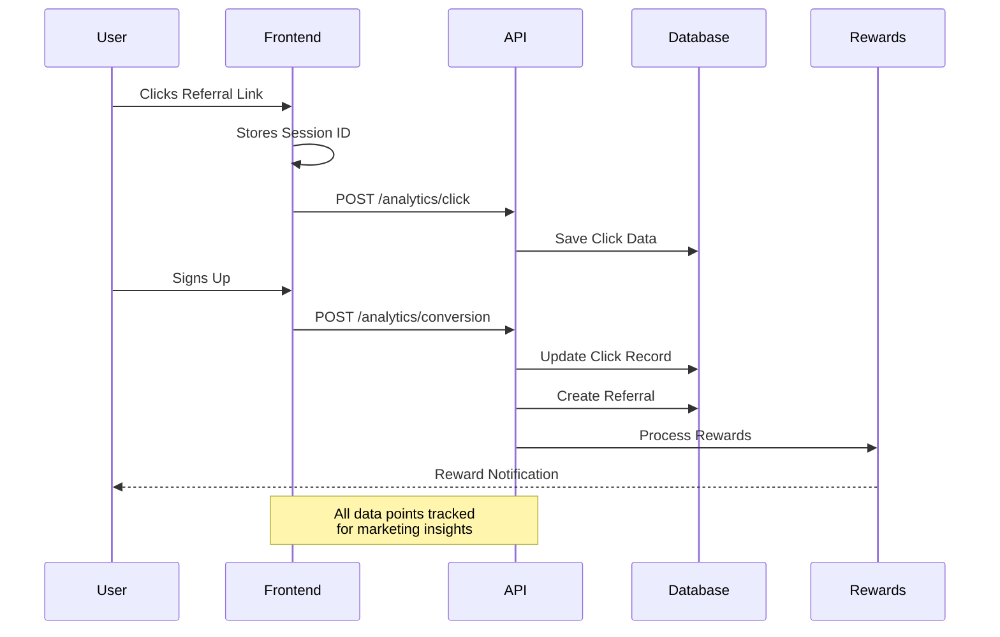

# DegenDuel Referral System

## Overview

DegenDuel's referral system is a comprehensive solution for tracking, analyzing, and rewarding user referrals. Think of it as a sophisticated tracking system that follows the entire journey of a user from the moment they click a friend's referral link to when they become an active user themselves.

### Simple Example

When Alice shares her referral link with Bob:

1. Bob clicks the link on Twitter
2. System tracks that click came from Twitter
3. Bob creates an account
4. Alice gets credit for referring Bob
5. Both Alice and Bob can earn rewards

### Referral Flow Visualization



### Data Collection Flow



## How It Works (Non-Technical)

### 1. The Referral Link

Think of a referral link as a special package that contains:

- Who shared it (the referrer)
- Where it was shared (Twitter, Discord, etc.)
- What campaign it's part of (if any)

### 2. Click Tracking

When someone clicks the link, we track:

- Where they came from (like clicking from Twitter vs. Discord)
- What device they're using (phone vs. computer)
- When they clicked
- A unique "session ID" (like a digital fingerprint)

This helps us understand:

- Which platforms bring the most users
- What times people are most likely to join
- Which devices our users prefer

### 3. Conversion Tracking

When someone creates an account:

- We match their signup to the original click
- This tells us how long people take to decide to join
- We can see which sources bring the most active users

## Core Features

### 1. Referral Code Generation

- Personalized codes based on username/nickname
- Fallback to random generation if needed
- Guaranteed uniqueness through collision handling
- Maximum length of 20 characters
- Uppercase format for consistency

### 2. Click Tracking

Captures detailed information about referral link clicks:

- Source of the click (direct, contest, profile)
- Landing page
- UTM parameters (source, medium, campaign)
- Device information
- Browser details
- IP address (for fraud prevention)
- User agent
- Session tracking
- Timestamp

### 3. Conversion Tracking

Monitors the entire referral journey:

- Click to signup conversion
- Qualification status
- Reward distribution
- Time to convert
- Session persistence

### 4. Analytics & Reporting

Provides comprehensive analytics:

- Click-through rates
- Conversion rates by source
- Device/browser statistics
- Geographic data
- UTM campaign performance
- Reward distribution metrics

## Technical Implementation

### Database Schema

#### Referrals Table

```sql
referrals {
  id               Int
  referrer_id      String
  referred_id      String
  referral_code    String
  status           ReferralStatus
  source           String?
  landing_page     String?
  utm_source       String?
  utm_medium       String?
  utm_campaign     String?
  device           String?
  browser          String?
  ip_address       String?
  user_agent       String?
  click_timestamp  DateTime?
  session_id       String?
  metadata         Json?
  created_at       DateTime
  qualified_at     DateTime?
  reward_paid_at   DateTime?
  reward_amount    Decimal?
}
```

#### Referral Clicks Table

```sql
referral_clicks {
  id              Int
  referral_code   String
  source          String
  landing_page    String
  utm_source      String?
  utm_medium      String?
  utm_campaign    String?
  device          String
  browser         String
  ip_address      String
  user_agent      String
  session_id      String
  timestamp       DateTime
  converted       Boolean
  converted_at    DateTime?
  referrer_id     String
}
```

### API Endpoints

#### 1. Track Referral Click

\`\`\`http
POST /api/referrals/analytics/click
Content-Type: application/json

{
"referralCode": "USER123",
"source": "twitter",
"landingPage": "/contest/123",
"utmParams": {
"source": "social",
"medium": "twitter",
"campaign": "summer_2024"
},
"device": "mobile",
"browser": "chrome",
"sessionId": "uuid-v4"
}
\`\`\`

#### 2. Track Conversion

\`\`\`http
POST /api/referrals/analytics/conversion
Authorization: Bearer <token>
Content-Type: application/json

{
"referralCode": "USER123",
"sessionId": "uuid-v4"
}
\`\`\`

#### 3. Get Analytics

\`\`\`http
GET /api/referrals/analytics
Authorization: Bearer <token>

Response:
{
"clicks": {
"by_source": {
"twitter": 50,
"discord": 30
},
"by_device": {
"mobile": 45,
"desktop": 35
},
"by_browser": {
"chrome": 40,
"safari": 25
}
},
"conversions": {
"by_source": {
"twitter": 10,
"discord": 8
}
},
"rewards": {
"by_type": {
"signup_bonus": "1000",
"contest_bonus": "500"
}
}
}
\`\`\`

## Security Measures

### Rate Limiting

1. Click Tracking:

   - 100 requests per IP per 15 minutes
   - Prevents click spam and abuse

2. Conversion Tracking:
   - 10 attempts per IP per hour
   - Requires authentication
   - Prevents conversion fraud

### Data Protection

- IP addresses stored securely
- User agent data encrypted
- Session IDs using UUID v4
- HTTPS required for all endpoints

## Analytics Capabilities

### 1. Traffic Analysis

- Source attribution
- Campaign effectiveness
- Landing page performance
- Device/browser trends

### 2. Conversion Analysis

- Conversion rates by source
- Time to conversion
- Drop-off points
- Campaign ROI

### 3. Reward Analysis

- Total rewards distributed
- Reward types breakdown
- Average reward per referral
- Top referrers

## Best Practices

### For Frontend Implementation

1. Track clicks immediately when referral link is clicked
2. Store sessionId in localStorage
3. Pass sessionId during registration
4. Handle errors gracefully
5. Implement retry logic for failed requests

### For Marketing Teams

1. Use UTM parameters consistently
2. Create unique campaigns for different channels
3. Monitor conversion rates by source
4. A/B test landing pages
5. Track ROI by campaign

## Monitoring & Maintenance

### Performance Metrics

- API response times
- Database query performance
- Rate limit hits
- Error rates

### Data Integrity

- Regular data validation
- Duplicate detection
- Fraud pattern monitoring
- Data cleanup routines

## Future Enhancements

### Planned Features

1. Advanced fraud detection
2. Machine learning for conversion optimization
3. Real-time analytics dashboard
4. Enhanced reward algorithms
5. Multi-tier referral system

### Integration Opportunities

1. Social media automation
2. Email marketing integration
3. Discord bot integration
4. Wallet tracking integration

## Troubleshooting

### Common Issues

1. Rate limit exceeded

   - Solution: Implement exponential backoff
   - Prevention: Cache referral data

2. Missing conversion data

   - Solution: Check session persistence
   - Prevention: Implement redundant tracking

3. Analytics discrepancies
   - Solution: Cross-reference raw data
   - Prevention: Implement data validation

## Support

For technical support or feature requests:

1. Contact DevOps team via Discord
2. Submit GitHub issue
3. Email support@degenduel.me

## Conclusion

The DegenDuel referral system provides a robust foundation for tracking and analyzing user acquisition through referrals. Its comprehensive analytics capabilities enable data-driven decisions for marketing and growth strategies.

## Marketing Insights (For Non-Technical Teams)

### What You Can Learn

- Which social platforms bring the most users
- What times of day your links get the most clicks
- How many clicks it takes to get one signup
- Which campaigns are most successful
- What devices your users prefer

### Example Insights

```
Twitter Campaign Results:
- 1000 clicks led to 100 signups (10% conversion)
- Most clicks between 6-8pm
- 70% from mobile devices
- Average time to signup: 2.3 days
```

## Testing Implementation

### Frontend Testing Strategy

We've implemented comprehensive unit tests for the referral system using Jest and React Testing Library. The testing approach focuses on:

1. **Hook Testing (`useReferral`)**

   ```typescript
   // Example test structure
   describe("useReferral", () => {
     it("initializes with default values", () => {
       // Tests basic hook initialization
     });
     it("loads referral code from URL params", () => {
       // Tests URL parameter handling
     });
     it("tracks conversion successfully", () => {
       // Tests conversion tracking
     });
   });
   ```

2. **Mock Implementation**

   ```typescript
   // API Mocking
   jest.mock("../services/dd-api", () => ({
     ddApi: {
       fetch: jest.fn().mockImplementation((path: string) => {
         // Mock responses for different endpoints
       }),
     },
   }));

   // LocalStorage Mocking
   const mockLocalStorage = {
     getItem: jest.fn(),
     setItem: jest.fn(),
     // ... other methods
   };
   ```

3. **Test Coverage Areas**
   - Initial state management
   - URL parameter handling
   - LocalStorage interaction
   - API calls and responses
   - Welcome modal behavior
   - Conversion tracking
   - Analytics data handling

### Key Test Scenarios

1. **Referral Code Handling**

   - Loading from URL parameters
   - Storing in localStorage
   - Clearing referral data

2. **Session Management**

   - Session ID generation
   - Session persistence
   - Session recovery

3. **Conversion Tracking**

   - API call validation
   - Payload structure
   - Success/failure handling

4. **Analytics Integration**
   - Data structure validation
   - Source attribution
   - Device/browser tracking

## Recent Improvements

### 1. Enhanced Error Handling

- Graceful handling of API failures
- Retry logic for failed conversions
- Improved error messaging

### 2. Session Management

- Robust session ID tracking
- Better persistence across page reloads
- Clear session cleanup

### 3. Analytics Enhancement

- More detailed click tracking
- Improved conversion attribution
- Better source tracking

### 4. Testing Infrastructure

- Comprehensive unit test coverage
- Mocked API responses
- Simulated user scenarios

## Integration with Frontend Architecture

### Component Structure

```
src/
├── hooks/
│   ├── useReferral.ts          # Core referral hook
│   └── useReferral.test.tsx    # Hook tests
├── components/
│   └── modals/
│       ├── ReferralWelcomeModal.tsx
│       └── ReferralWelcomeModal.test.tsx
└── services/
    └── dd-api.ts               # API client
```

### State Management

- URL parameters for initial referral
- LocalStorage for persistence
- Context API for global state
- Clean state management in tests

## Testing Best Practices

### 1. Component Testing

- Test user interactions
- Verify state changes
- Mock external dependencies
- Test error states

### 2. Hook Testing

- Test initialization
- Test state updates
- Test side effects
- Mock context providers

### 3. Integration Testing

- Test component interaction
- Verify data flow
- Test real-world scenarios

## Monitoring & Debugging

### Test Coverage Metrics

- Current coverage: [Update with actual %]
- Key areas covered:
  - Hook functionality
  - Component rendering
  - User interactions
  - API integration

### Performance Monitoring

- API response times
- State update efficiency
- Memory usage
- Test execution time

## Conclusion

The DegenDuel referral system provides a robust foundation for tracking and analyzing user acquisition through referrals. Its comprehensive analytics capabilities enable data-driven decisions for marketing and growth strategies.

## Marketing Insights (For Non-Technical Teams)

### What You Can Learn

- Which social platforms bring the most users
- What times of day your links get the most clicks
- How many clicks it takes to get one signup
- Which campaigns are most successful
- What devices your users prefer

### Example Insights

```
Twitter Campaign Results:
- 1000 clicks led to 100 signups (10% conversion)
- Most clicks between 6-8pm
- 70% from mobile devices
- Average time to signup: 2.3 days
```

## Backend Implementation Details

### Service Architecture

The referral system is built on our modern service architecture pattern:

```javascript
class ReferralService extends BaseService {
    constructor() {
        super(REFERRAL_SERVICE_CONFIG.name, REFERRAL_SERVICE_CONFIG);
        // Service-specific state initialization
    }
}
```

### Configuration

```javascript
const REFERRAL_SERVICE_CONFIG = {
    name: 'referral_service',
    checkIntervalMs: 5 * 60 * 1000,  // Check every 5 minutes
    maxRetries: 3,
    retryDelayMs: 30000,
    circuitBreaker: {
        failureThreshold: 5,
        resetTimeoutMs: 60000,
        minHealthyPeriodMs: 120000
    },
    tracking: {
        maxClicksPerIP: 100,
        clickWindowMs: 15 * 60 * 1000,  // 15 minutes
        maxConversionsPerIP: 10,
        conversionWindowMs: 60 * 60 * 1000  // 1 hour
    }
}
```

### Statistics Tracking

The service maintains detailed statistics:

```javascript
referralStats: {
    operations: {
        total: 0,
        successful: 0,
        failed: 0
    },
    clicks: {
        total: 0,
        by_source: {},
        by_device: {},
        by_campaign: {}
    },
    conversions: {
        total: 0,
        by_source: {},
        successful: 0,
        failed: 0
    },
    rewards: {
        total_distributed: new Decimal(0),
        by_type: {},
        pending: 0
    }
}
```

### Rate Limiting

Backend implements two-tier rate limiting:

1. Click Tracking:
   - 100 requests per IP per 15 minutes
   - Prevents click spam and tracking abuse

2. Conversion Tracking:
   - 10 attempts per IP per hour
   - Requires authentication
   - Prevents conversion fraud

### Error Handling

The service implements comprehensive error handling:

```javascript
try {
    // Operation logic
} catch (error) {
    if (error.isServiceError) {
        // Handle known service errors
        logApi.error('Service error:', error);
    } else {
        // Handle unexpected errors
        logApi.error('Unexpected error:', error);
    }
    throw error;
}
```

### Automatic Reward Processing

The service automatically processes pending rewards:

```javascript
async performOperation() {
    // Process pending rewards older than 24 hours
    const pendingReferrals = await prisma.referrals.findMany({
        where: {
            status: 'PENDING',
            click_timestamp: {
                lte: new Date(Date.now() - 24 * 60 * 1000)
            }
        }
    });
    
    // Process each pending referral
    for (const referral of pendingReferrals) {
        await this.processRewards(referral.id);
    }
}
```

### Circuit Breaker Protection

The service includes circuit breaker protection to prevent system overload:

- Fails fast after 5 consecutive failures
- 1-minute timeout when circuit is open
- Requires 2 minutes of health before fully resetting

### Database Schemas

#### Referral Clicks
```sql
CREATE TABLE referral_clicks (
    id SERIAL PRIMARY KEY,
    referral_code VARCHAR(20) NOT NULL,
    referrer_id VARCHAR(44) NOT NULL,
    source VARCHAR(50),
    landing_page TEXT,
    utm_source VARCHAR(50),
    utm_medium VARCHAR(50),
    utm_campaign VARCHAR(50),
    device VARCHAR(20),
    browser VARCHAR(50),
    ip_address VARCHAR(45),
    user_agent TEXT,
    session_id UUID NOT NULL,
    timestamp TIMESTAMP NOT NULL,
    converted BOOLEAN DEFAULT FALSE,
    converted_at TIMESTAMP
);

CREATE INDEX idx_referral_clicks_session ON referral_clicks(session_id);
CREATE INDEX idx_referral_clicks_timestamp ON referral_clicks(timestamp);
```

#### Referrals
```sql
CREATE TABLE referrals (
    id SERIAL PRIMARY KEY,
    referrer_id VARCHAR(44) NOT NULL,
    referred_id VARCHAR(44) NOT NULL,
    referral_code VARCHAR(20) NOT NULL,
    status VARCHAR(20) NOT NULL,
    source VARCHAR(50),
    landing_page TEXT,
    utm_source VARCHAR(50),
    utm_medium VARCHAR(50),
    utm_campaign VARCHAR(50),
    device VARCHAR(20),
    browser VARCHAR(50),
    ip_address VARCHAR(45),
    user_agent TEXT,
    click_timestamp TIMESTAMP,
    session_id UUID,
    created_at TIMESTAMP NOT NULL DEFAULT CURRENT_TIMESTAMP,
    qualified_at TIMESTAMP,
    reward_paid_at TIMESTAMP,
    reward_amount DECIMAL(18,6)
);

CREATE INDEX idx_referrals_status ON referrals(status);
CREATE INDEX idx_referrals_referrer ON referrals(referrer_id);
```

### Performance Considerations

1. **Database Indexing**
   - Indexed session_id for quick conversion matching
   - Indexed timestamp for efficient analytics queries
   - Indexed status for reward processing queries

2. **Rate Limiting**
   - Implemented at both application and database levels
   - Prevents abuse and ensures system stability

3. **Batch Processing**
   - Reward processing happens in batches
   - Configurable batch sizes and intervals

### Monitoring

The service exposes detailed metrics:

1. **Operation Metrics**
   - Success/failure rates
   - Average operation times
   - Circuit breaker status

2. **Business Metrics**
   - Conversion rates by source
   - Reward distribution stats
   - Traffic patterns

3. **System Health**
   - Database connection status
   - Rate limit hits
   - Error rates

### Maintenance Tasks

1. **Daily**
   - Process pending rewards
   - Clean up expired sessions
   - Update analytics cache

2. **Weekly**
   - Aggregate historical data
   - Generate performance reports
   - Optimize database indexes

3. **Monthly**
   - Archive old click data
   - Generate trend analysis
   - Review rate limit configurations

### Security Measures

1. **Data Protection**
   - IP addresses hashed for storage
   - User agent data sanitized
   - Session IDs use UUID v4

2. **Fraud Prevention**
   - IP-based rate limiting
   - Session validation
   - Duplicate click detection

3. **Access Control**
   - Authentication required for sensitive operations
   - Role-based access for analytics
   - Audit logging for all admin actions
