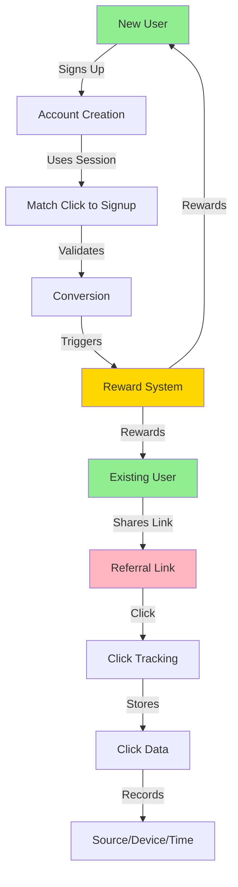
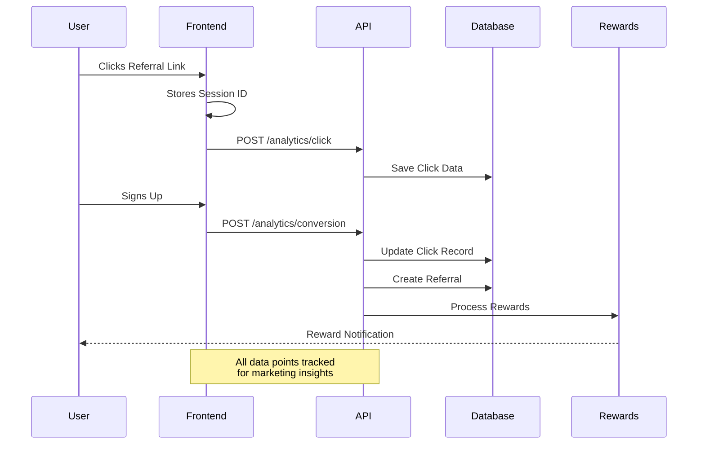

# DegenDuel Referral System Documentation

## Table of Contents
1. [Overview](#overview)
2. [System Architecture](#system-architecture)
3. [Core Features](#core-features)
4. [Frontend Implementation](#frontend-implementation)
5. [Backend Implementation](#backend-implementation)
6. [API Reference](#api-reference)
7. [Database Schema](#database-schema)
8. [Security & Rate Limiting](#security--rate-limiting)
9. [Analytics & Tracking](#analytics--tracking)
10. [Reward System](#reward-system)
11. [Testing & Quality Assurance](#testing--quality-assurance)
12. [Integration Points](#integration-points)
13. [Maintenance & Monitoring](#maintenance--monitoring)
14. [Recent Improvements](#recent-improvements)

## Overview

DegenDuel's referral system is a comprehensive solution for tracking, analyzing, and rewarding user referrals. The system follows users from their first interaction with a referral link through conversion and beyond, providing detailed analytics and automated reward distribution.

### Simple Example

When Alice shares her referral link with Bob:

1. Bob clicks the link on Twitter
2. System tracks that click came from Twitter
3. Bob creates an account
4. Alice gets credit for referring Bob
5. Both Alice and Bob can earn rewards

### Key Components Flow



### Data Collection Flow



## System Architecture

### Service Configuration

```javascript
const REFERRAL_SERVICE_CONFIG = {
    name: 'referral_service',
    checkIntervalMs: 5 * 60 * 1000,  // 5 minutes
    maxRetries: 3,
    retryDelayMs: 30000,
    circuitBreaker: {
        failureThreshold: 5,
        resetTimeoutMs: 60000,
        minHealthyPeriodMs: 120000
    },
    tracking: {
        maxClicksPerIP: 100,
        clickWindowMs: 15 * 60 * 1000,
        maxConversionsPerIP: 10,
        conversionWindowMs: 60 * 60 * 1000
    },
    cache: {
        periodStatsTTL: 300,
        rankingsTTL: 60
    }
}
```

## Frontend Implementation

### Component Structure

```
src/
├── hooks/
│   ├── useReferral.ts          # Core referral hook
│   └── useReferral.test.tsx    # Hook tests
├── components/
│   └── modals/
│       ├── ReferralWelcomeModal.tsx
│       └── ReferralWelcomeModal.test.tsx
└── services/
    └── dd-api.ts               # API client
```

### State Management
- URL parameters for initial referral
- LocalStorage for persistence
- Context API for global state
- Clean state management in tests

## Core Features

### 1. Referral Code Management
- **Generation**: Unique codes based on username/nickname or random fallback
- **Format**: Uppercase, max 20 characters
- **Collision Handling**: Automatic suffix addition for uniqueness

### 2. Click Tracking
- Source attribution
- Device and browser information
- UTM parameter tracking
- Session management
- IP tracking (for security)
- Timestamp recording

### 3. Conversion Tracking
- Session-based matching
- Status tracking (pending/qualified)
- Reward processing
- Analytics integration

### 4. Analytics & Reporting
- Click-through rates
- Conversion rates by source
- Device/browser statistics
- Geographic data
- UTM campaign performance
- Reward distribution metrics

## Testing & Quality Assurance

### Frontend Testing Strategy

1. **Hook Testing (`useReferral`)**
```typescript
// Example test structure
describe("useReferral", () => {
  it("initializes with default values", () => {
    // Tests basic hook initialization
  });
  it("loads referral code from URL params", () => {
    // Tests URL parameter handling
  });
  it("tracks conversion successfully", () => {
    // Tests conversion tracking
  });
});
```

2. **Mock Implementation**
```typescript
// API Mocking
jest.mock("../services/dd-api", () => ({
  ddApi: {
    fetch: jest.fn().mockImplementation((path: string) => {
      // Mock responses for different endpoints
    }),
  },
}));

// LocalStorage Mocking
const mockLocalStorage = {
  getItem: jest.fn(),
  setItem: jest.fn(),
  // ... other methods
};
```

3. **Test Coverage Areas**
- Initial state management
- URL parameter handling
- LocalStorage interaction
- API calls and responses
- Welcome modal behavior
- Conversion tracking
- Analytics data handling

### Key Test Scenarios

1. **Referral Code Handling**
- Loading from URL parameters
- Storing in localStorage
- Clearing referral data

2. **Session Management**
- Session ID generation
- Session persistence
- Session recovery

3. **Conversion Tracking**
- API call validation
- Payload structure
- Success/failure handling

4. **Analytics Integration**
- Data structure validation
- Source attribution
- Device/browser tracking

## Backend Implementation

### Service Architecture
```javascript
class ReferralService extends BaseService {
    constructor() {
        super(REFERRAL_SERVICE_CONFIG.name, REFERRAL_SERVICE_CONFIG);
        // Service-specific state initialization
    }
}
```

### Statistics Tracking
```javascript
referralStats: {
    operations: {
        total: 0,
        successful: 0,
        failed: 0
    },
    clicks: {
        total: 0,
        by_source: {},
        by_device: {},
        by_campaign: {}
    },
    conversions: {
        total: 0,
        by_source: {},
        successful: 0,
        failed: 0
    },
    rewards: {
        total_distributed: new Decimal(0),
        by_type: {},
        pending: 0
    }
}
```

### Error Handling
```javascript
try {
    // Operation logic
} catch (error) {
    if (error.isServiceError) {
        // Handle known service errors
        logApi.error('Service error:', error);
    } else {
        // Handle unexpected errors
        logApi.error('Unexpected error:', error);
    }
    throw error;
}
```

## API Reference

### Referral Code Endpoints

#### Get/Generate Code
```http
GET /api/referrals/code
Authorization: Bearer <token>

Response:
{
    "referral_code": "USER123"
}
```

#### Apply Code
```http
POST /api/referrals/apply
Content-Type: application/json

{
    "referral_code": "USER123",
    "wallet_address": "wallet_address_here"
}
```

## Database Schema

### Referral Clicks Table
```sql
CREATE TABLE referral_clicks (
    id SERIAL PRIMARY KEY,
    referral_code VARCHAR(20) NOT NULL,
    referrer_id VARCHAR(44) NOT NULL,
    source VARCHAR(50),
    landing_page TEXT,
    utm_source VARCHAR(50),
    utm_medium VARCHAR(50),
    utm_campaign VARCHAR(50),
    device VARCHAR(20),
    browser VARCHAR(50),
    ip_address VARCHAR(45),
    user_agent TEXT,
    session_id UUID NOT NULL,
    timestamp TIMESTAMPTZ DEFAULT CURRENT_TIMESTAMP,
    converted BOOLEAN DEFAULT FALSE,
    converted_at TIMESTAMPTZ,
    FOREIGN KEY (referrer_id) REFERENCES users(wallet_address)
);

CREATE INDEX idx_referral_clicks_code ON referral_clicks(referral_code);
CREATE INDEX idx_referral_clicks_session ON referral_clicks(session_id);
```

## Security & Rate Limiting

### Rate Limits
1. Click Tracking:
   - 100 requests per IP per 15 minutes
   - Prevents click spam and abuse

2. Conversion Tracking:
   - 10 attempts per IP per hour
   - Requires authentication
   - Prevents conversion fraud

### Security Measures
1. Data Protection:
   - IP addresses hashed for storage
   - User agent data sanitized
   - Session IDs use UUID v4

2. Fraud Prevention:
   - IP-based rate limiting
   - Session validation
   - Duplicate click detection

3. Access Control:
   - Authentication required for sensitive operations
   - Role-based access for analytics
   - Audit logging for all admin actions

## Reward System

### Configuration
```javascript
{
    "period_length": "weekly",
    "reward_tiers": {
        "milestone_1": {"referrals": 100, "reward": 1000},
        "milestone_2": {"referrals": 500, "reward": 10000},
        "milestone_3": {"referrals": 1000, "reward": 25000}
    },
    "leaderboard_rewards": {
        "top_3": [5000, 3000, 1000],
        "top_10": 500
    }
}
```

### Period Management
```javascript
class ReferralPeriodManager {
    async createNewPeriod() {
        const settings = await this.getSystemSettings();
        const periodLength = settings.period_length;
        
        // Calculate period dates based on configuration
        const { startDate, endDate } = this.calculatePeriodDates(periodLength);
        
        // Create new period
        return await prisma.referral_periods.create({
            data: {
                start_date: startDate,
                end_date: endDate,
                is_active: true,
                status: 'in_progress'
            }
        });
    }
}
```

## Maintenance & Monitoring

### Daily Tasks
- Process pending rewards
- Update analytics cache
- Clean expired sessions

### Weekly Tasks
- Generate performance reports
- Update leaderboards
- Optimize database indexes

### Monthly Tasks
- Archive old data
- Review rate limits
- Generate trend analysis

### Monitoring Metrics
1. System Health
   - API response times
   - Database performance
   - Error rates
   - Rate limit hits

2. Business Metrics
   - Conversion rates
   - Reward distribution
   - Traffic patterns
   - User engagement

3. Security Metrics
   - Failed attempts
   - Suspicious patterns
   - IP blacklist hits
   - Authentication failures

## Best Practices

### For Frontend Implementation
1. Track clicks immediately
2. Store sessionId securely
3. Handle errors gracefully
4. Implement retry logic
5. Validate input data

### For Marketing Teams
1. Use consistent UTM parameters
2. Create unique campaigns
3. Monitor conversion rates
4. A/B test landing pages
5. Track ROI by campaign

### For Development
1. Follow rate limit guidelines
2. Implement proper error handling
3. Use transaction blocks
4. Cache frequently accessed data
5. Monitor performance metrics

## Recent Improvements

### 1. Enhanced Error Handling
- Graceful handling of API failures
- Retry logic for failed conversions
- Improved error messaging

### 2. Session Management
- Robust session ID tracking
- Better persistence across page reloads
- Clear session cleanup

### 3. Analytics Enhancement
- More detailed click tracking
- Improved conversion attribution
- Better source tracking

### 4. Testing Infrastructure
- Comprehensive unit test coverage
- Mocked API responses
- Simulated user scenarios

## Marketing Insights (For Non-Technical Teams)

### What You Can Learn
- Which social platforms bring the most users
- What times of day your links get the most clicks
- How many clicks it takes to get one signup
- Which campaigns are most successful
- What devices your users prefer

### Example Insights
```
Twitter Campaign Results:
- 1000 clicks led to 100 signups (10% conversion)
- Most clicks between 6-8pm
- 70% from mobile devices
- Average time to signup: 2.3 days
```

## Integration Points

### Contest System Integration

#### Referral Qualification in Contests
```javascript
// Check referral qualification during contest join
router.post('/:id/join', requireAuth, async (req, res) => {
    try {
        // Check referral qualification
        await ReferralService.checkContestQualification(wallet_address);
        
        // Process contest join
        const result = await prisma.$transaction(async (prisma) => {
            // Contest join logic
        });
    } catch (error) {
        logApi.error('Failed to join contest:', error);
        res.status(500).json({ error: error.message });
    }
});
```

#### Contest Performance Tracking
```javascript
// Track contest performance for referral bonuses
async function processContestCompletion(contestId, rankings) {
    for (const ranking of rankings.slice(0, 3)) {
        await ReferralService.awardContestBonus(
            ranking.wallet_address,
            contestId,
            ranking.rank
        );
    }
}
```

### Wallet Integration

#### Reward Distribution
```javascript
class RewardDistributor {
    async distributeReward(referralId, amount) {
        const referral = await prisma.referrals.findUnique({
            where: { id: referralId }
        });

        // Create wallet transaction
        const transaction = await prisma.transactions.create({
            data: {
                wallet_address: referral.referrer_id,
                amount: amount,
                type: 'REFERRAL_REWARD',
                status: 'PENDING',
                metadata: {
                    referral_id: referralId,
                    reward_type: 'referral_bonus'
                }
            }
        });

        // Process blockchain transaction
        await this.processBlockchainTransaction(transaction);
    }
}
```

## Advanced Features

### Multi-tier Referral System

#### Configuration
```javascript
const MULTI_TIER_CONFIG = {
    max_depth: 3,
    reward_distribution: {
        tier_1: 0.5,  // 50% to direct referrer
        tier_2: 0.3,  // 30% to tier 2
        tier_3: 0.2   // 20% to tier 3
    },
    qualification_criteria: {
        min_referrals: 5,
        min_activity_days: 30
    }
};
```

#### Implementation
```javascript
class MultiTierReferralProcessor {
    async processMultiTierRewards(referralId) {
        const referralChain = await this.getReferralChain(referralId);
        const totalReward = await this.calculateTotalReward(referralId);

        for (let tier = 0; tier < Math.min(referralChain.length, MULTI_TIER_CONFIG.max_depth); tier++) {
            const referrer = referralChain[tier];
            const tierPercentage = MULTI_TIER_CONFIG.reward_distribution[`tier_${tier + 1}`];
            
            if (await this.isQualified(referrer.wallet_address)) {
                await this.distributeReward(
                    referrer.wallet_address,
                    totalReward * tierPercentage
                );
            }
        }
    }
}
```

### Fraud Detection System

#### Pattern Detection
```javascript
class FraudDetector {
    async analyzePatterns(referralId) {
        const patterns = {
            suspicious_ip: await this.checkIPPatterns(referralId),
            time_anomaly: await this.checkTimePatterns(referralId),
            device_mismatch: await this.checkDevicePatterns(referralId),
            conversion_speed: await this.checkConversionSpeed(referralId)
        };

        return this.calculateRiskScore(patterns);
    }

    async checkIPPatterns(referralId) {
        const clicks = await prisma.referral_clicks.findMany({
            where: { referral_code: referralId },
            select: { ip_address: true, timestamp: true }
        });

        return this.detectAnomalies(clicks, 'ip_address');
    }
}
```

#### Risk Scoring
```javascript
class RiskScorer {
    calculateRiskScore(patterns) {
        const weights = {
            suspicious_ip: 0.3,
            time_anomaly: 0.2,
            device_mismatch: 0.2,
            conversion_speed: 0.3
        };

        return Object.entries(patterns).reduce((score, [key, value]) => {
            return score + (value * weights[key]);
        }, 0);
    }
}
```

## Troubleshooting Guide

### Common Issues and Solutions

#### 1. Missing Conversion Data
```javascript
async function diagnoseConversionIssue(sessionId) {
    // Check click record
    const click = await prisma.referral_clicks.findFirst({
        where: { session_id: sessionId }
    });
    
    if (!click) {
        return {
            issue: 'MISSING_CLICK',
            solution: 'Verify click tracking implementation'
        };
    }

    // Check session storage
    const sessionData = await cache.get(`session:${sessionId}`);
    if (!sessionData) {
        return {
            issue: 'EXPIRED_SESSION',
            solution: 'Adjust session timeout settings'
        };
    }

    // Additional checks...
}
```

#### 2. Reward Distribution Failures
```javascript
async function diagnoseRewardIssue(referralId) {
    const referral = await prisma.referrals.findUnique({
        where: { id: referralId },
        include: {
            rewards: true,
            referrer: {
                select: {
                    wallet_status: true
                }
            }
        }
    });

    const issues = [];
    
    if (referral.referrer.wallet_status !== 'ACTIVE') {
        issues.push({
            type: 'WALLET_ISSUE',
            description: 'Referrer wallet is not active',
            solution: 'Contact user to activate wallet'
        });
    }

    if (referral.rewards.some(r => r.status === 'FAILED')) {
        issues.push({
            type: 'TRANSACTION_FAILURE',
            description: 'Previous reward transaction failed',
            solution: 'Check blockchain transaction logs'
        });
    }

    return issues;
}
```

### Performance Optimization

#### Caching Strategy
```javascript
class ReferralCache {
    constructor() {
        this.cache = new Map();
        this.stats = new Map();
    }

    async getCachedReferralData(referralCode) {
        const cacheKey = `referral:${referralCode}`;
        
        if (this.cache.has(cacheKey)) {
            this.stats.set(cacheKey, {
                hits: (this.stats.get(cacheKey)?.hits || 0) + 1,
                lastAccess: Date.now()
            });
            return this.cache.get(cacheKey);
        }

        const data = await this.fetchReferralData(referralCode);
        this.cache.set(cacheKey, data);
        return data;
    }

    async optimizeCache() {
        const now = Date.now();
        for (const [key, stats] of this.stats.entries()) {
            if (now - stats.lastAccess > 3600000 && stats.hits < 10) {
                this.cache.delete(key);
                this.stats.delete(key);
            }
        }
    }
}
```

#### Database Optimization
```sql
-- Additional indexes for performance
CREATE INDEX idx_referrals_status_created ON referrals(status, created_at);
CREATE INDEX idx_referral_clicks_source_timestamp ON referral_clicks(source, timestamp);
CREATE INDEX idx_referral_rewards_type_amount ON referral_rewards(reward_type, amount);

-- Partitioning for large tables
CREATE TABLE referral_clicks_partitioned (
    LIKE referral_clicks INCLUDING INDEXES
) PARTITION BY RANGE (timestamp);

-- Create partitions
CREATE TABLE referral_clicks_y2024m01 
    PARTITION OF referral_clicks_partitioned
    FOR VALUES FROM ('2024-01-01') TO ('2024-02-01');

-- Optimize query performance
CREATE MATERIALIZED VIEW referral_stats_daily AS
SELECT 
    DATE_TRUNC('day', timestamp) as day,
    source,
    COUNT(*) as click_count,
    COUNT(DISTINCT referrer_id) as unique_referrers,
    COUNT(CASE WHEN converted THEN 1 END) as conversions
FROM referral_clicks
GROUP BY 1, 2
WITH DATA;

CREATE UNIQUE INDEX ON referral_stats_daily (day, source);
```

## API Testing Suite

### Integration Tests
```typescript
describe('Referral API Integration Tests', () => {
    describe('Click Tracking', () => {
        it('should track click with valid parameters', async () => {
            const response = await request(app)
                .post('/api/referrals/analytics/click')
                .send({
                    referralCode: 'TEST123',
                    source: 'twitter',
                    device: 'mobile'
                });
            
            expect(response.status).toBe(200);
            expect(response.body).toHaveProperty('success', true);
        });

        it('should handle rate limiting', async () => {
            // Generate 101 requests (over limit)
            const requests = Array(101).fill().map(() => 
                request(app)
                    .post('/api/referrals/analytics/click')
                    .send({
                        referralCode: 'TEST123',
                        source: 'twitter'
                    })
            );

            const responses = await Promise.all(requests);
            const lastResponse = responses[responses.length - 1];

            expect(lastResponse.status).toBe(429);
            expect(lastResponse.body).toHaveProperty('error', 'Rate limit exceeded');
        });
    });
});
```

### Load Testing
```javascript
import { check } from 'k6';
import http from 'k6/http';

export const options = {
    stages: [
        { duration: '1m', target: 50 },  // Ramp up
        { duration: '3m', target: 50 },  // Stay at 50 users
        { duration: '1m', target: 0 }    // Ramp down
    ],
    thresholds: {
        http_req_duration: ['p(95)<500'],  // 95% of requests should be below 500ms
        http_req_failed: ['rate<0.01']     // Less than 1% can fail
    }
};

export default function() {
    const payload = {
        referralCode: 'LOADTEST',
        source: 'k6_test',
        device: 'test_device'
    };

    const response = http.post(
        'http://api.degenduel.com/referrals/analytics/click',
        JSON.stringify(payload),
        { headers: { 'Content-Type': 'application/json' } }
    );

    check(response, {
        'is status 200': (r) => r.status === 200,
        'has success flag': (r) => r.json('success') === true
    });
}
```

## Deployment & Infrastructure

### Docker Configuration
```dockerfile
# Referral Service Dockerfile
FROM node:18-alpine

WORKDIR /app

# Install dependencies
COPY package*.json ./
RUN npm ci --only=production

# Copy application code
COPY . .

# Set environment variables
ENV NODE_ENV=production
ENV SERVICE_NAME=referral-service

# Health check
HEALTHCHECK --interval=30s --timeout=3s \
  CMD curl -f http://localhost:${PORT}/health || exit 1

# Start the service
CMD ["npm", "run", "start:prod"]
```

### Kubernetes Configuration
```yaml
apiVersion: apps/v1
kind: Deployment
metadata:
  name: referral-service
spec:
  replicas: 3
  selector:
    matchLabels:
      app: referral-service
  template:
    metadata:
      labels:
        app: referral-service
    spec:
      containers:
      - name: referral-service
        image: degenduel/referral-service:latest
        ports:
        - containerPort: 3000
        env:
        - name: DATABASE_URL
          valueFrom:
            secretKeyRef:
              name: db-credentials
              key: url
        resources:
          requests:
            memory: "256Mi"
            cpu: "200m"
          limits:
            memory: "512Mi"
            cpu: "500m"
        livenessProbe:
          httpGet:
            path: /health
            port: 3000
          initialDelaySeconds: 30
          periodSeconds: 10
```

## Monitoring & Alerting

### Prometheus Metrics
```javascript
import prometheus from 'prom-client';

// Create metrics
const clickCounter = new prometheus.Counter({
    name: 'referral_clicks_total',
    help: 'Total number of referral link clicks',
    labelNames: ['source', 'device']
});

const conversionGauge = new prometheus.Gauge({
    name: 'referral_conversion_rate',
    help: 'Current referral conversion rate'
});

const rewardHistogram = new prometheus.Histogram({
    name: 'referral_reward_distribution',
    help: 'Distribution of referral rewards',
    buckets: [100, 500, 1000, 5000, 10000]
});

// Implement metrics collection
class MetricsCollector {
    recordClick(source, device) {
        clickCounter.inc({ source, device });
    }

    updateConversionRate(rate) {
        conversionGauge.set(rate);
    }

    recordReward(amount) {
        rewardHistogram.observe(amount);
    }
}
```

### Alert Rules
```yaml
groups:
- name: referral-alerts
  rules:
  - alert: HighFailureRate
    expr: rate(referral_conversion_failures_total[5m]) > 0.1
    for: 5m
    labels:
      severity: critical
    annotations:
      summary: High referral conversion failure rate
      description: Conversion failures exceed 10% in the last 5 minutes

  - alert: LowConversionRate
    expr: referral_conversion_rate < 0.05
    for: 30m
    labels:
      severity: warning
    annotations:
      summary: Low referral conversion rate
      description: Conversion rate below 5% for 30 minutes

  - alert: RewardDistributionDelay
    expr: time() - referral_last_reward_distribution_timestamp > 3600
    for: 15m
    labels:
      severity: warning
    annotations:
      summary: Reward distribution delay
      description: No rewards distributed in the last hour
```

## Data Analysis & Reporting

### Analytics Queries
```sql
-- Conversion funnel analysis
WITH funnel AS (
    SELECT
        DATE_TRUNC('day', c.timestamp) as date,
        COUNT(DISTINCT c.session_id) as clicks,
        COUNT(DISTINCT CASE WHEN c.converted THEN c.session_id END) as conversions,
        COUNT(DISTINCT CASE WHEN r.status = 'qualified' THEN r.id END) as qualified,
        COUNT(DISTINCT CASE WHEN r.reward_paid_at IS NOT NULL THEN r.id END) as rewarded
    FROM referral_clicks c
    LEFT JOIN referrals r ON c.session_id = r.session_id
    GROUP BY 1
)
SELECT
    date,
    clicks,
    conversions,
    qualified,
    rewarded,
    ROUND(conversions::numeric / NULLIF(clicks, 0) * 100, 2) as conversion_rate,
    ROUND(qualified::numeric / NULLIF(conversions, 0) * 100, 2) as qualification_rate
FROM funnel
ORDER BY date DESC;

-- Source performance analysis
SELECT
    source,
    COUNT(*) as total_clicks,
    COUNT(DISTINCT referrer_id) as unique_referrers,
    COUNT(DISTINCT CASE WHEN converted THEN session_id END) as conversions,
    ROUND(AVG(EXTRACT(EPOCH FROM (converted_at - timestamp)) / 3600), 2) as avg_conversion_hours,
    ROUND(COUNT(DISTINCT CASE WHEN converted THEN session_id END)::numeric / 
          COUNT(DISTINCT session_id) * 100, 2) as conversion_rate
FROM referral_clicks
WHERE timestamp >= NOW() - INTERVAL '30 days'
GROUP BY source
ORDER BY total_clicks DESC;
```

### Automated Reports
```javascript
class ReportGenerator {
    async generateDailyReport() {
        const yesterday = new Date(Date.now() - 86400000);
        
        const metrics = await this.collectMetrics(yesterday);
        const report = this.formatReport(metrics);
        
        await this.distributeReport(report);
    }

    async collectMetrics(date) {
        const [clicks, conversions, rewards] = await Promise.all([
            this.getClickMetrics(date),
            this.getConversionMetrics(date),
            this.getRewardMetrics(date)
        ]);

        return {
            date,
            clicks,
            conversions,
            rewards,
            performance: this.calculatePerformance({
                clicks,
                conversions,
                rewards
            })
        };
    }

    formatReport(metrics) {
        return {
            title: `Daily Referral Report - ${metrics.date.toLocaleDateString()}`,
            summary: {
                total_clicks: metrics.clicks.total,
                conversion_rate: metrics.performance.conversion_rate,
                total_rewards: metrics.rewards.total
            },
            details: {
                by_source: metrics.clicks.by_source,
                by_device: metrics.clicks.by_device,
                conversion_funnel: metrics.conversions.funnel,
                reward_distribution: metrics.rewards.distribution
            },
            trends: this.calculateTrends(metrics)
        };
    }
}
``` 